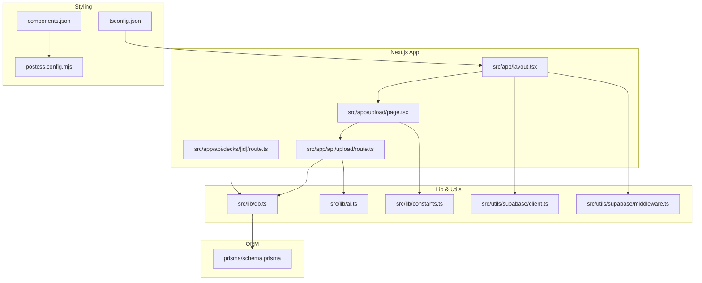
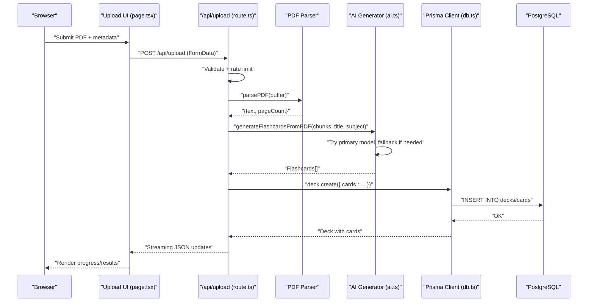
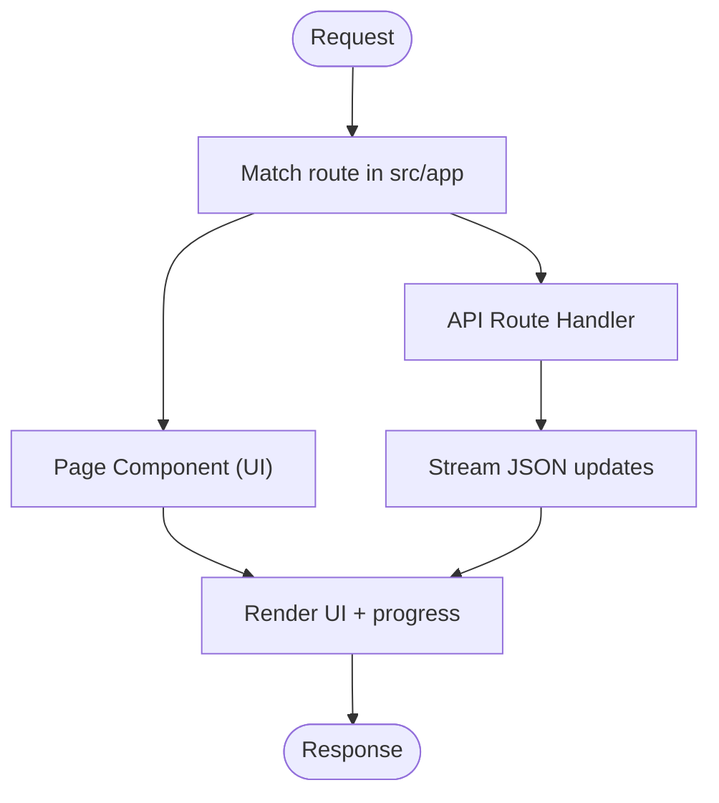
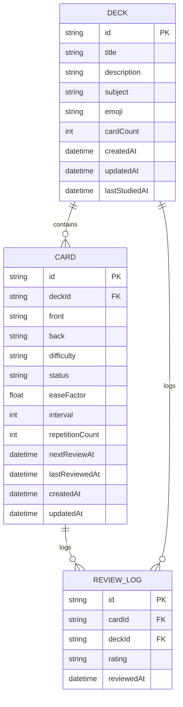
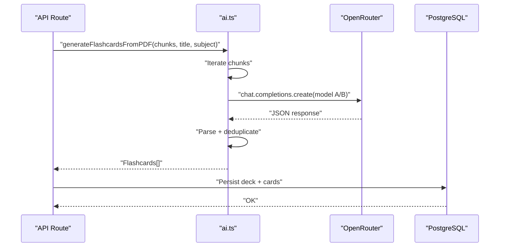
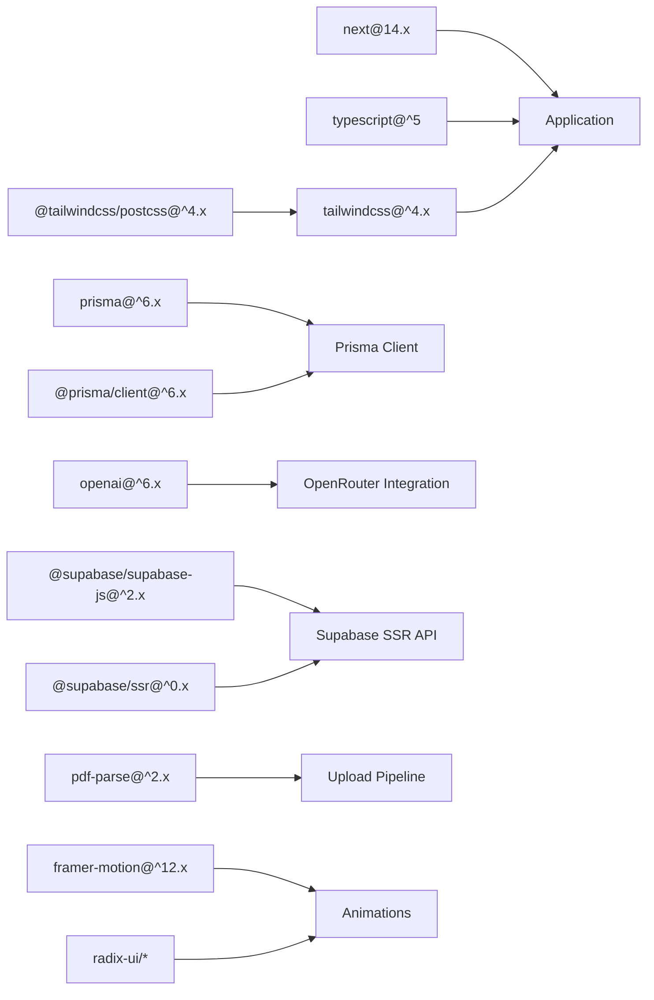

# Technology Stack

<cite>
**Referenced Files in This Document**
- [package.json](file://package.json)
- [next.config.mjs](file://next.config.mjs)
- [tsconfig.json](file://tsconfig.json)
- [components.json](file://components.json)
- [postcss.config.mjs](file://postcss.config.mjs)
- [prisma/schema.prisma](file://prisma/schema.prisma)
- [src/lib/db.ts](file://src/lib/db.ts)
- [src/lib/ai.ts](file://src/lib/ai.ts)
- [src/app/layout.tsx](file://src/app/layout.tsx)
- [src/app/api/upload/route.ts](file://src/app/api/upload/route.ts)
- [src/app/api/decks/[id]/route.ts](file://src/app/api/decks/[id]/route.ts)
- [src/components/layout/AppLayout.tsx](file://src/components/layout/AppLayout.tsx)
- [src/app/upload/page.tsx](file://src/app/upload/page.tsx)
- [src/utils/supabase/client.ts](file://src/utils/supabase/client.ts)
- [src/utils/supabase/middleware.ts](file://src/utils/supabase/middleware.ts)
- [src/lib/constants.ts](file://src/lib/constants.ts)
</cite>

## Table of Contents
1. [Introduction](#introduction)
2. [Project Structure](#project-structure)
3. [Core Components](#core-components)
4. [Architecture Overview](#architecture-overview)
5. [Detailed Component Analysis](#detailed-component-analysis)
6. [Dependency Analysis](#dependency-analysis)
7. [Performance Considerations](#performance-considerations)
8. [Security Considerations](#security-considerations)
9. [Version Requirements and Compatibility](#version-requirements-and-compatibility)
10. [Upgrade Paths](#upgrade-paths)
11. [Troubleshooting Guide](#troubleshooting-guide)
12. [Conclusion](#conclusion)

## Introduction
This document provides a comprehensive technology stack overview for the recall application. It explains the complete tech ecosystem and architectural choices, focusing on Next.js 14 with App Router, TypeScript configuration, Tailwind CSS styling, Prisma ORM with PostgreSQL, OpenAI/OpenRouter integration, and deployment infrastructure. For each technology, it outlines rationale, integration patterns, and how they collectively support the application’s goals of transforming PDFs into smart flashcards using AI-powered generation and spaced repetition.

## Project Structure
The project follows a modern Next.js 14 App Router structure with a clear separation of concerns:
- Application shell and metadata are defined in the root layout.
- Feature-based pages and API routes live under src/app.
- Shared UI components and utilities are organized under src/components and src/lib.
- Styling is configured via Tailwind CSS and PostCSS.
- Database access is abstracted through Prisma client initialization.
- AI generation logic resides in a dedicated module.
- Supabase utilities provide SSR-safe client and middleware helpers.

**Diagram sources**
- [src/app/layout.tsx:1-52](file://src/app/layout.tsx#L1-L52)
- [src/app/upload/page.tsx:1-504](file://src/app/upload/page.tsx#L1-L504)
- [src/app/api/upload/route.ts:1-298](file://src/app/api/upload/route.ts#L1-L298)
- [src/app/api/decks/[id]/route.ts](file://src/app/api/decks/[id]/route.ts#L1-L43)
- [src/lib/db.ts:1-68](file://src/lib/db.ts#L1-L68)
- [src/lib/ai.ts:1-233](file://src/lib/ai.ts#L1-L233)
- [src/lib/constants.ts:1-31](file://src/lib/constants.ts#L1-L31)
- [src/utils/supabase/client.ts:1-11](file://src/utils/supabase/client.ts#L1-L11)
- [src/utils/supabase/middleware.ts:1-38](file://src/utils/supabase/middleware.ts#L1-L38)
- [components.json:1-21](file://components.json#L1-L21)
- [postcss.config.mjs:1-8](file://postcss.config.mjs#L1-L8)
- [tsconfig.json:1-27](file://tsconfig.json#L1-L27)
- [prisma/schema.prisma:1-51](file://prisma/schema.prisma#L1-L51)

**Section sources**
- [src/app/layout.tsx:1-52](file://src/app/layout.tsx#L1-L52)
- [src/app/upload/page.tsx:1-504](file://src/app/upload/page.tsx#L1-L504)
- [src/app/api/upload/route.ts:1-298](file://src/app/api/upload/route.ts#L1-L298)
- [src/app/api/decks/[id]/route.ts](file://src/app/api/decks/[id]/route.ts#L1-L43)
- [src/lib/db.ts:1-68](file://src/lib/db.ts#L1-L68)
- [src/lib/ai.ts:1-233](file://src/lib/ai.ts#L1-L233)
- [src/lib/constants.ts:1-31](file://src/lib/constants.ts#L1-L31)
- [src/utils/supabase/client.ts:1-11](file://src/utils/supabase/client.ts#L1-L11)
- [src/utils/supabase/middleware.ts:1-38](file://src/utils/supabase/middleware.ts#L1-L38)
- [components.json:1-21](file://components.json#L1-L21)
- [postcss.config.mjs:1-8](file://postcss.config.mjs#L1-L8)
- [tsconfig.json:1-27](file://tsconfig.json#L1-L27)
- [prisma/schema.prisma:1-51](file://prisma/schema.prisma#L1-L51)

## Core Components
- Next.js 14 App Router: Provides file-system routing, metadata, and streaming responses for long-running tasks.
- TypeScript: Enforced strictness with bundler resolution and incremental compilation for reliability.
- Tailwind CSS + shadcn/ui: Utility-first styling with a typed component library and PostCSS integration.
- Prisma ORM: Strongly-typed database client with schema-driven migrations and connection pooling considerations.
- OpenAI/OpenRouter: AI generation pipeline for flashcard creation with fallback models and robust error handling.
- Supabase: SSR-safe client and cookie-aware middleware for session management.
- PDF parsing and chunking: Server-side PDF extraction and structured chunking for AI consumption.

**Section sources**
- [package.json:1-56](file://package.json#L1-L56)
- [tsconfig.json:1-27](file://tsconfig.json#L1-L27)
- [components.json:1-21](file://components.json#L1-L21)
- [postcss.config.mjs:1-8](file://postcss.config.mjs#L1-L8)
- [prisma/schema.prisma:1-51](file://prisma/schema.prisma#L1-L51)
- [src/lib/ai.ts:1-233](file://src/lib/ai.ts#L1-L233)
- [src/lib/db.ts:1-68](file://src/lib/db.ts#L1-L68)
- [src/utils/supabase/client.ts:1-11](file://src/utils/supabase/client.ts#L1-L11)
- [src/utils/supabase/middleware.ts:1-38](file://src/utils/supabase/middleware.ts#L1-L38)

## Architecture Overview
The application is a full-stack Next.js 14 app with a clear separation between client UI, server actions, and backend services. The upload flow demonstrates a streaming pipeline that parses PDFs, generates flashcards via AI, and persists data to PostgreSQL through Prisma.

**Diagram sources**
- [src/app/upload/page.tsx:84-177](file://src/app/upload/page.tsx#L84-L177)
- [src/app/api/upload/route.ts:86-297](file://src/app/api/upload/route.ts#L86-L297)
- [src/lib/ai.ts:168-232](file://src/lib/ai.ts#L168-L232)
- [src/lib/db.ts:232-251](file://src/lib/db.ts#L232-L251)

**Section sources**
- [src/app/upload/page.tsx:1-504](file://src/app/upload/page.tsx#L1-L504)
- [src/app/api/upload/route.ts:1-298](file://src/app/api/upload/route.ts#L1-L298)
- [src/lib/ai.ts:1-233](file://src/lib/ai.ts#L1-L233)
- [src/lib/db.ts:1-68](file://src/lib/db.ts#L1-L68)

## Detailed Component Analysis

### Next.js 14 App Router and Routing
- File-system routing organizes pages and API routes under src/app.
- Streaming responses are enabled for long-running operations (e.g., PDF processing).
- Metadata and viewport configuration are centralized in the root layout.

**Diagram sources**
- [src/app/layout.tsx:1-52](file://src/app/layout.tsx#L1-L52)
- [src/app/api/upload/route.ts:164-297](file://src/app/api/upload/route.ts#L164-L297)

**Section sources**
- [src/app/layout.tsx:1-52](file://src/app/layout.tsx#L1-L52)
- [src/app/api/upload/route.ts:7-9](file://src/app/api/upload/route.ts#L7-L9)

### TypeScript Configuration
- Strict type checking with bundler module resolution.
- Path aliases mapped via tsconfig for clean imports.
- Incremental compilation and isolated modules for performance.

**Section sources**
- [tsconfig.json:1-27](file://tsconfig.json#L1-L27)

### Tailwind CSS and shadcn/ui
- Tailwind is integrated via PostCSS plugin.
- shadcn/ui is configured with RSC support, TSX, and custom aliases.
- Global CSS is imported in the root layout.

**Section sources**
- [postcss.config.mjs:1-8](file://postcss.config.mjs#L1-L8)
- [components.json:1-21](file://components.json#L1-L21)
- [src/app/layout.tsx:5-5](file://src/app/layout.tsx#L5-L5)

### Prisma ORM and PostgreSQL
- Schema defines Deck, Card, and ReviewLog entities with relations.
- Connection URL selection prioritizes platform-specific variables and ensures SSL.
- Client initialization supports development hot reload and production pooling.

**Diagram sources**
- [prisma/schema.prisma:10-50](file://prisma/schema.prisma#L10-L50)
- [src/lib/db.ts:49-63](file://src/lib/db.ts#L49-L63)

**Section sources**
- [prisma/schema.prisma:1-51](file://prisma/schema.prisma#L1-L51)
- [src/lib/db.ts:1-68](file://src/lib/db.ts#L1-L68)

### OpenAI/OpenRouter Integration
- Lazy client instantiation prevents build failures when API keys are absent.
- Dual-model fallback improves availability for free-tier usage.
- Robust JSON parsing with fallback extraction and retry logic.
- Controlled request pacing to respect rate limits.

**Diagram sources**
- [src/app/api/upload/route.ts:204-210](file://src/app/api/upload/route.ts#L204-L210)
- [src/lib/ai.ts:98-153](file://src/lib/ai.ts#L98-L153)
- [src/lib/db.ts:232-251](file://src/lib/db.ts#L232-L251)

**Section sources**
- [src/lib/ai.ts:1-233](file://src/lib/ai.ts#L1-L233)
- [src/app/api/upload/route.ts:1-298](file://src/app/api/upload/route.ts#L1-L298)

### Supabase Utilities (SSR + Middleware)
- Browser client creation uses public environment variables.
- Server middleware manages cookies and integrates with Next.js request lifecycle.
- Ensures secure, SSR-safe Supabase access across the app.

**Section sources**
- [src/utils/supabase/client.ts:1-11](file://src/utils/supabase/client.ts#L1-L11)
- [src/utils/supabase/middleware.ts:1-38](file://src/utils/supabase/middleware.ts#L1-L38)

### Upload Flow and UI
- Client-side drag-and-drop upload with validation.
- Streaming progress updates via server-sent JSON lines.
- Confetti celebration on successful completion.

**Section sources**
- [src/app/upload/page.tsx:1-504](file://src/app/upload/page.tsx#L1-L504)
- [src/app/api/upload/route.ts:164-297](file://src/app/api/upload/route.ts#L164-L297)

### Layout and Navigation
- Centralized layout adapts UI based on current route.
- Sidebar and top bar provide navigation scaffolding.

**Section sources**
- [src/components/layout/AppLayout.tsx:1-41](file://src/components/layout/AppLayout.tsx#L1-L41)

## Dependency Analysis
The application’s dependencies are intentionally scoped to core functionality:
- Next.js 14 provides the runtime and App Router.
- Prisma and @prisma/client power database operations.
- Tailwind CSS and shadcn/ui deliver styling and UI primitives.
- OpenAI SDK integrates with OpenRouter for generative AI.
- Supabase libraries enable SSR-safe client and middleware.
- Additional libraries support PDF parsing, animations, and utilities.

**Diagram sources**
- [package.json:18-53](file://package.json#L18-L53)

**Section sources**
- [package.json:1-56](file://package.json#L1-L56)

## Performance Considerations
- Next.js streaming: Enables immediate feedback during long operations (e.g., PDF parsing and AI generation).
- Request pacing: Delays between chunk processing reduce free-tier rate limit risks.
- Connection pooling: Prisma URL selection prefers pooled endpoints in production for scalability.
- Build-time externals: Server-only modules (e.g., pdf-parse) are excluded from browser bundles to avoid bundling issues.
- Tailwind incremental builds: PostCSS plugin and incremental TS compilation improve DX and build times.

[No sources needed since this section provides general guidance]

## Security Considerations
- Environment variables: API keys and database URLs are loaded from environment variables; misconfiguration triggers explicit error messages.
- Cookie management: Supabase middleware synchronizes cookies with Next.js request/response lifecycle.
- Rate limiting: IP-based rate limiting protects upstream services and prevents abuse.
- SSL enforcement: Prisma URL ensures sslmode=require for secure connections in serverless contexts.

**Section sources**
- [src/app/api/upload/route.ts:86-116](file://src/app/api/upload/route.ts#L86-L116)
- [src/lib/db.ts:41-47](file://src/lib/db.ts#L41-L47)
- [src/utils/supabase/middleware.ts:15-34](file://src/utils/supabase/middleware.ts#L15-L34)

## Version Requirements and Compatibility
- Next.js 14: App Router, metadata, and runtime directives are used extensively.
- TypeScript ^5: Enforced via tsconfig strictness and bundler resolution.
- Tailwind CSS ^4.x: Integrated via @tailwindcss/postcss plugin.
- Prisma ^6.x: Client and generator aligned with schema.
- OpenAI SDK ^6.x: Used with OpenRouter base URL and API key.
- Supabase: @supabase/ssr and @supabase/supabase-js for SSR-safe client and middleware.
- Node.js: Next.js 14 targets modern Node.js LTS; align runtime with deployment platform.

**Section sources**
- [package.json:18-53](file://package.json#L18-L53)
- [next.config.mjs:1-14](file://next.config.mjs#L1-L14)
- [tsconfig.json:1-27](file://tsconfig.json#L1-L27)
- [postcss.config.mjs:1-8](file://postcss.config.mjs#L1-L8)
- [prisma/schema.prisma:1-8](file://prisma/schema.prisma#L1-L8)

## Upgrade Paths
- Next.js: Follow official release notes; test App Router behavior and metadata changes.
- TypeScript: Incrementally adopt new compiler options; verify bundler resolution and path aliases.
- Tailwind CSS: Review breaking changes in v4; validate PostCSS plugin and component configurations.
- Prisma: Keep client and generator in sync; test migrations and schema changes.
- OpenAI/OpenRouter: Monitor API changes and pricing; adjust fallback strategies and rate limits.
- Supabase: Align with latest SSR and middleware APIs; verify cookie handling and environment variables.

[No sources needed since this section provides general guidance]

## Troubleshooting Guide
Common issues and resolutions:
- Missing OPENROUTER_API_KEY: The upload route returns a clear error instructing to configure the environment variable.
- Rate limit errors: Free-tier quotas trigger user-friendly messages; advise retry after cooldown.
- Model unavailability: Graceful fallback to secondary models reduces downtime.
- Database connectivity: Misconfigured DATABASE_URL leads to explicit connection failure messages.
- PDF parsing failures: Short text content or image-based PDFs produce actionable error messages.

**Section sources**
- [src/app/api/upload/route.ts:11-63](file://src/app/api/upload/route.ts#L11-L63)
- [src/lib/ai.ts:98-125](file://src/lib/ai.ts#L98-L125)
- [src/lib/db.ts:8-39](file://src/lib/db.ts#L8-L39)

## Conclusion
The recall application leverages a cohesive stack centered on Next.js 14 App Router, TypeScript, Tailwind CSS, Prisma, OpenAI/OpenRouter, and Supabase. These technologies integrate to deliver a responsive, scalable, and secure experience for converting PDFs into smart flashcards powered by AI. The architecture emphasizes streaming UX, robust error handling, and production-ready database and API practices.