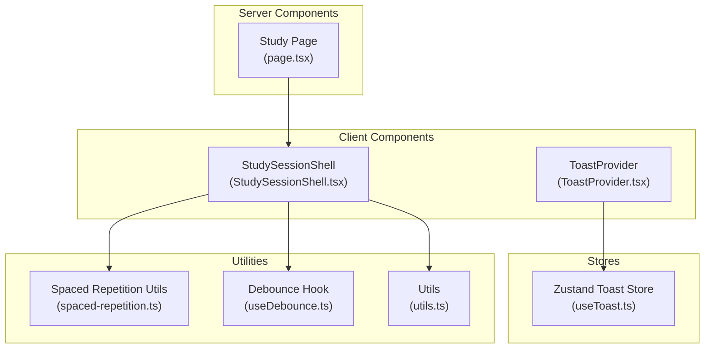
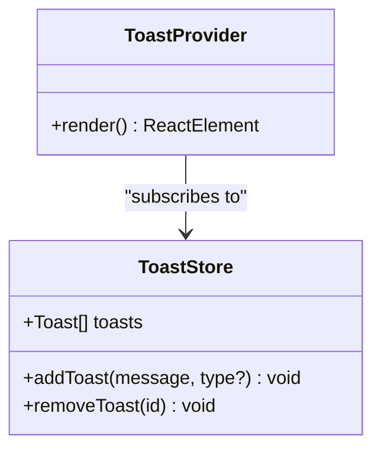
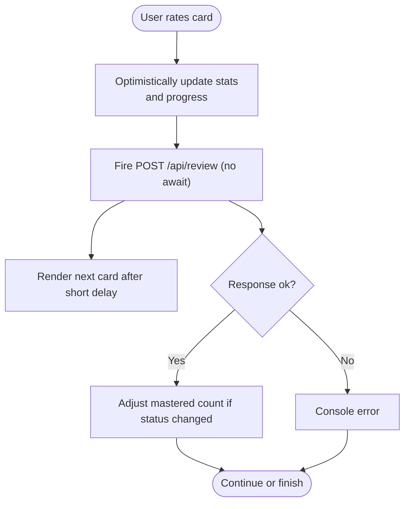
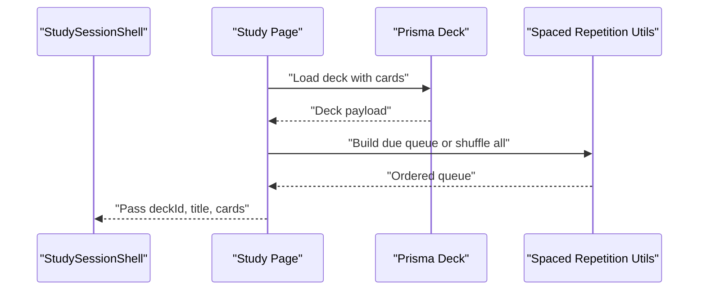
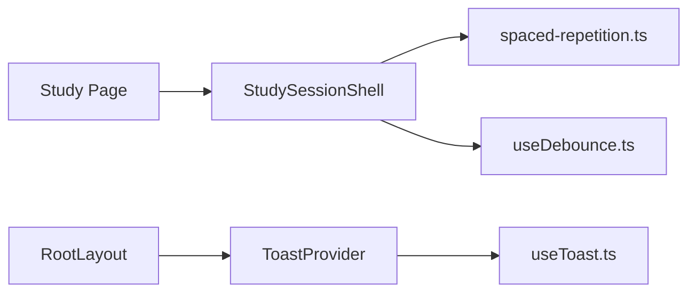

# State Management

<cite>
**Referenced Files in This Document**
- [useDebounce.ts](file://src/hooks/useDebounce.ts)
- [StudySessionShell.tsx](file://src/components/flashcard/StudySessionShell.tsx)
- [page.tsx](file://src/app/decks/[id]/study/page.tsx)
- [spaced-repetition.ts](file://src/lib/spaced-repetition.ts)
- [useToast.ts](file://src/lib/store/useToast.ts)
- [ToastProvider.tsx](file://src/components/ui/ToastProvider.tsx)
- [layout.tsx](file://src/app/layout.tsx)
- [utils.ts](file://src/lib/utils.ts)
</cite>

## Table of Contents
1. [Introduction](#introduction)
2. [Project Structure](#project-structure)
3. [Core Components](#core-components)
4. [Architecture Overview](#architecture-overview)
5. [Detailed Component Analysis](#detailed-component-analysis)
6. [Dependency Analysis](#dependency-analysis)
7. [Performance Considerations](#performance-considerations)
8. [Troubleshooting Guide](#troubleshooting-guide)
9. [Conclusion](#conclusion)

## Introduction
This document explains recall’s state management architecture with a focus on the Zustand store implementation, global state patterns, and component state strategies. It documents state slices for study sessions, user preferences, and application state; covers state synchronization between components, server state updates, and optimistic UI patterns; and provides guidance on hooks usage, debounced state updates, and performance optimization. It also addresses state persistence, hydration from server components, and state cleanup patterns, with concrete examples drawn from the codebase.

## Project Structure
The state management spans several layers:
- Global stores: Zustand-backed stores for cross-component notifications.
- Component-local state: React state and refs for UI and session-specific data.
- Server-side hydration: Next.js app router pages hydrate client components with precomputed data.
- Utility hooks: Debounce logic for controlled updates.



**Diagram sources**
- [page.tsx:30-91](file://src/app/decks/[id]/study/page.tsx#L30-L91)
- [StudySessionShell.tsx:42-430](file://src/components/flashcard/StudySessionShell.tsx#L42-L430)
- [ToastProvider.tsx:28-65](file://src/components/ui/ToastProvider.tsx#L28-L65)
- [useToast.ts:17-36](file://src/lib/store/useToast.ts#L17-L36)
- [spaced-repetition.ts:29-104](file://src/lib/spaced-repetition.ts#L29-L104)
- [useDebounce.ts:3-17](file://src/hooks/useDebounce.ts#L3-L17)
- [utils.ts:9-19](file://src/lib/utils.ts#L9-L19)

**Section sources**
- [page.tsx:30-91](file://src/app/decks/[id]/study/page.tsx#L30-L91)
- [StudySessionShell.tsx:42-430](file://src/components/flashcard/StudySessionShell.tsx#L42-L430)
- [useToast.ts:17-36](file://src/lib/store/useToast.ts#L17-L36)
- [ToastProvider.tsx:28-65](file://src/components/ui/ToastProvider.tsx#L28-L65)
- [spaced-repetition.ts:29-104](file://src/lib/spaced-repetition.ts#L29-L104)
- [useDebounce.ts:3-17](file://src/hooks/useDebounce.ts#L3-L17)
- [utils.ts:9-19](file://src/lib/utils.ts#L9-L19)

## Core Components
- Zustand toast store: A lightweight, global notification slice with add/remove actions and auto-expiration.
- Study session shell: A client component orchestrating local UI state, keyboard interactions, optimistic updates, and server synchronization.
- Spaced repetition utilities: Pure functions computing card scheduling and building the study queue.
- Debounce hook: A reusable hook to throttle updates to derived state.
- Layout and provider: Application-level hydration and toast rendering.

Key implementation patterns:
- Local component state for UI and transient session data (e.g., current card index, flip state, submission guard).
- Ref for immutable session stats during a session lifecycle.
- Optimistic UI: Advance the UI immediately upon user action, then reconcile with server response asynchronously.
- Server hydration: The study page computes and passes a deterministic queue to the client.

**Section sources**
- [useToast.ts:17-36](file://src/lib/store/useToast.ts#L17-L36)
- [ToastProvider.tsx:28-65](file://src/components/ui/ToastProvider.tsx#L28-L65)
- [StudySessionShell.tsx:42-125](file://src/components/flashcard/StudySessionShell.tsx#L42-L125)
- [spaced-repetition.ts:29-104](file://src/lib/spaced-repetition.ts#L29-L104)
- [useDebounce.ts:3-17](file://src/hooks/useDebounce.ts#L3-L17)
- [page.tsx:30-91](file://src/app/decks/[id]/study/page.tsx#L30-L91)

## Architecture Overview
The state architecture blends client-side Zustand stores with component-local state and server-side hydration:

```mermaid
sequenceDiagram
participant User as "User"
participant Shell as "StudySessionShell"
participant Server as "Review API"
participant Store as "Zustand Toast Store"
User->>Shell : "Rate current card"
Shell->>Shell : "Optimistically update stats and progress"
Shell->>Server : "POST /api/review (fire-and-forget)"
Server-->>Shell : "Async response with update status"
Shell->>Shell : "Adjust mastered count if needed"
Shell-->>User : "Immediate UI feedback"
Note over Shell,Server : "UI advances instantly; server response reconciles state"
User->>Store : "Trigger toast via app-level actions"
Store-->>User : "Toast appears and auto-dismisses"
```

**Diagram sources**
- [StudySessionShell.tsx:68-125](file://src/components/flashcard/StudySessionShell.tsx#L68-L125)
- [useToast.ts:17-36](file://src/lib/store/useToast.ts#L17-L36)

## Detailed Component Analysis

### Zustand Toast Store
- Purpose: Provide a global, ephemeral notification slice with automatic cleanup.
- Slice shape: toasts array, addToast(message, type?), removeToast(id).
- Behavior: addToast generates a random id, appends to the array, and schedules removal after a fixed timeout.
- Consumption: ToastProvider renders toasts with animations and allows manual dismissal.



**Diagram sources**
- [useToast.ts:11-15](file://src/lib/store/useToast.ts#L11-L15)
- [ToastProvider.tsx:28-65](file://src/components/ui/ToastProvider.tsx#L28-L65)

**Section sources**
- [useToast.ts:17-36](file://src/lib/store/useToast.ts#L17-L36)
- [ToastProvider.tsx:28-65](file://src/components/ui/ToastProvider.tsx#L28-L65)

### Study Session Shell (Client Component)
- Responsibilities:
  - Manage local UI state: current card index, flip state, direction, completion, confirmation modal, submission guard.
  - Track session stats in a ref scoped to the session lifecycle.
  - Build optimistic UI: advance progress immediately on rating, then reconcile with server response.
  - Handle keyboard shortcuts and navigation.
- Data flow:
  - Receives hydrated queue from server page.
  - Uses spaced repetition utilities to compute next steps.
  - Calls server endpoint to persist review decisions.



**Diagram sources**
- [StudySessionShell.tsx:68-125](file://src/components/flashcard/StudySessionShell.tsx#L68-L125)

**Section sources**
- [StudySessionShell.tsx:42-430](file://src/components/flashcard/StudySessionShell.tsx#L42-L430)
- [spaced-repetition.ts:29-104](file://src/lib/spaced-repetition.ts#L29-L104)

### Server Hydration and Queue Building
- The study page is an async route that loads deck data and constructs a queue:
  - Converts Prisma cards to the internal CardForReview format.
  - Builds either a shuffled set (mode=all) or a due-based queue (default limit).
  - Passes the queue to the client component as props.
- This pattern ensures deterministic hydration and avoids race conditions between client and server.



**Diagram sources**
- [page.tsx:30-91](file://src/app/decks/[id]/study/page.tsx#L30-L91)
- [spaced-repetition.ts:88-104](file://src/lib/spaced-repetition.ts#L88-L104)

**Section sources**
- [page.tsx:30-91](file://src/app/decks/[id]/study/page.tsx#L30-L91)
- [spaced-repetition.ts:88-104](file://src/lib/spaced-repetition.ts#L88-L104)

### Hooks and Utilities
- Debounce hook: Returns a delayed value to reduce re-renders for rapidly changing inputs.
- Utility helpers: Relative date formatting and greeting generation support UI messaging.

**Section sources**
- [useDebounce.ts:3-17](file://src/hooks/useDebounce.ts#L3-L17)
- [utils.ts:9-19](file://src/lib/utils.ts#L9-L19)

## Dependency Analysis
- Client component depends on:
  - Server page for hydrated data.
  - Spaced repetition utilities for queue computation.
  - Zustand store for global notifications.
  - Debounce hook for controlled updates.
- Provider depends on the toast store to render notifications.



**Diagram sources**
- [page.tsx:30-91](file://src/app/decks/[id]/study/page.tsx#L30-L91)
- [StudySessionShell.tsx:42-430](file://src/components/flashcard/StudySessionShell.tsx#L42-L430)
- [spaced-repetition.ts:29-104](file://src/lib/spaced-repetition.ts#L29-L104)
- [useDebounce.ts:3-17](file://src/hooks/useDebounce.ts#L3-L17)
- [ToastProvider.tsx:28-65](file://src/components/ui/ToastProvider.tsx#L28-L65)
- [useToast.ts:17-36](file://src/lib/store/useToast.ts#L17-L36)
- [layout.tsx:39-51](file://src/app/layout.tsx#L39-L51)

**Section sources**
- [page.tsx:30-91](file://src/app/decks/[id]/study/page.tsx#L30-L91)
- [StudySessionShell.tsx:42-430](file://src/components/flashcard/StudySessionShell.tsx#L42-L430)
- [spaced-repetition.ts:29-104](file://src/lib/spaced-repetition.ts#L29-L104)
- [useDebounce.ts:3-17](file://src/hooks/useDebounce.ts#L3-L17)
- [ToastProvider.tsx:28-65](file://src/components/ui/ToastProvider.tsx#L28-L65)
- [useToast.ts:17-36](file://src/lib/store/useToast.ts#L17-L36)
- [layout.tsx:39-51](file://src/app/layout.tsx#L39-L51)

## Performance Considerations
- Optimistic UI reduces perceived latency by updating the UI immediately and reconciling later. The client component advances the card and progress without awaiting the server request.
- Fire-and-forget network requests avoid blocking animations; errors are logged but do not halt the UX.
- Debounce hook prevents excessive re-renders for derived state, useful when composing UI from rapidly changing inputs.
- Server hydration eliminates client-side fetching and ensures deterministic queues, reducing network overhead and variability.

[No sources needed since this section provides general guidance]

## Troubleshooting Guide
- Toasts not appearing:
  - Ensure the provider is mounted in the application layout and subscribed to the store.
  - Verify that addToast is called with a message and optional type.
- Toasts not auto-dismissing:
  - Confirm the store’s addToast implementation schedules removal after the expected timeout.
- Study session not progressing:
  - Check that rateCard is invoked and not blocked by the submission guard.
  - Verify the server endpoint responds with the expected update status to adjust mastered counts.
- Queue appears empty:
  - Confirm the server page builds the queue deterministically and passes cards to the client.
  - Validate that the due-date filtering aligns with current time normalization.

**Section sources**
- [ToastProvider.tsx:28-65](file://src/components/ui/ToastProvider.tsx#L28-L65)
- [useToast.ts:17-36](file://src/lib/store/useToast.ts#L17-L36)
- [StudySessionShell.tsx:68-125](file://src/components/flashcard/StudySessionShell.tsx#L68-L125)
- [page.tsx:30-91](file://src/app/decks/[id]/study/page.tsx#L30-L91)

## Conclusion
Recall’s state management combines a small, focused Zustand store for global notifications with robust client-side component state and server-side hydration. The study session shell exemplifies optimistic UI and fire-and-forget updates, while the server page guarantees deterministic queue construction. Supporting utilities and hooks enable responsive, efficient interactions. Together, these patterns deliver a smooth, reliable learning experience with clear separation of concerns across layers.