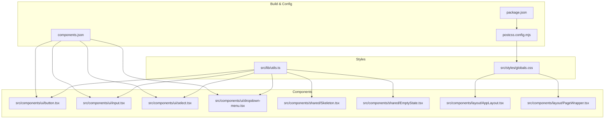
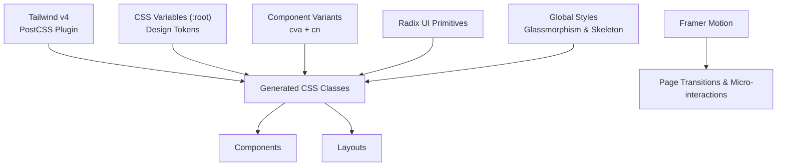
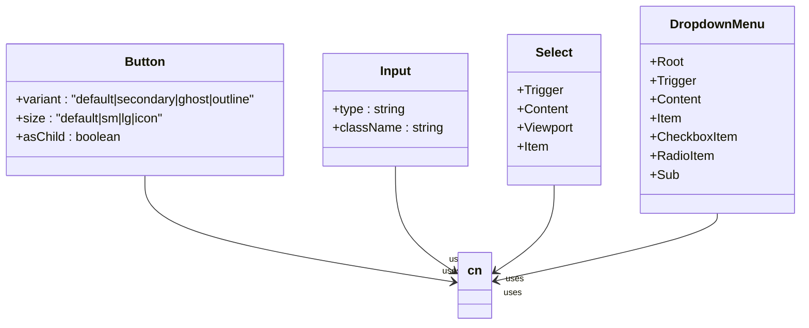
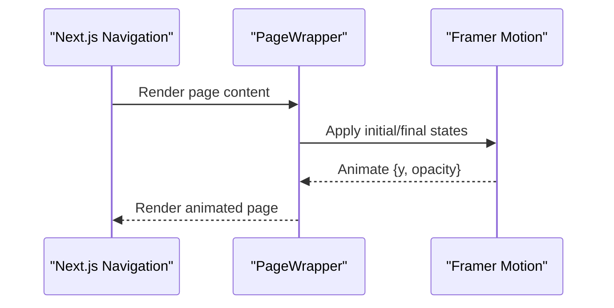
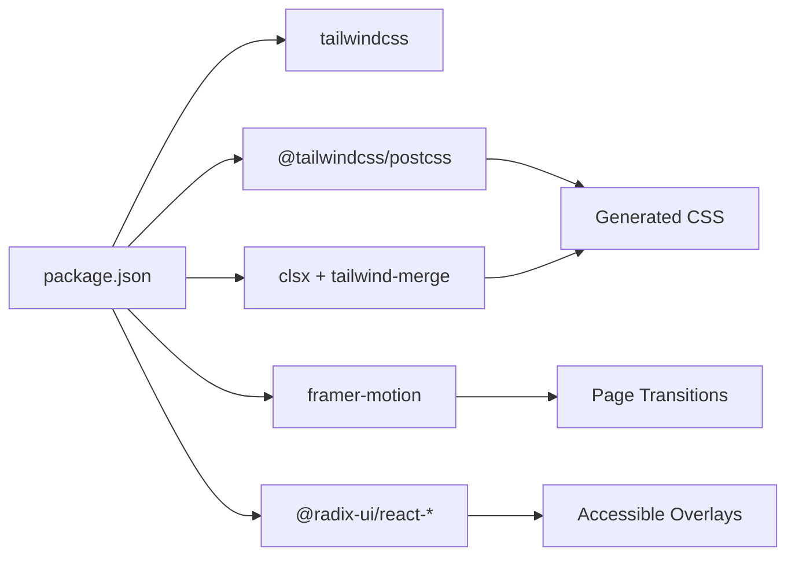

# Styling & UI/UX

<cite>
**Referenced Files in This Document**
- [package.json](file://package.json)
- [postcss.config.mjs](file://postcss.config.mjs)
- [components.json](file://components.json)
- [globals.css](file://src/styles/globals.css)
- [utils.ts](file://src/lib/utils.ts)
- [button.tsx](file://src/components/ui/button.tsx)
- [input.tsx](file://src/components/ui/input.tsx)
- [select.tsx](file://src/components/ui/select.tsx)
- [dropdown-menu.tsx](file://src/components/ui/dropdown-menu.tsx)
- [Skeleton.tsx](file://src/components/shared/Skeleton.tsx)
- [EmptyState.tsx](file://src/components/shared/EmptyState.tsx)
- [AppLayout.tsx](file://src/components/layout/AppLayout.tsx)
- [PageWrapper.tsx](file://src/components/layout/PageWrapper.tsx)
</cite>

## Table of Contents
1. [Introduction](#introduction)
2. [Project Structure](#project-structure)
3. [Core Components](#core-components)
4. [Architecture Overview](#architecture-overview)
5. [Detailed Component Analysis](#detailed-component-analysis)
6. [Dependency Analysis](#dependency-analysis)
7. [Performance Considerations](#performance-considerations)
8. [Troubleshooting Guide](#troubleshooting-guide)
9. [Conclusion](#conclusion)
10. [Appendices](#appendices)

## Introduction
This document describes recall’s styling and user experience design system. It covers Tailwind CSS configuration, design tokens, component styling patterns, the glassmorphism aesthetic, dark theme implementation, responsive design approach, animation system using Framer Motion, micro-interactions, visual feedback patterns, component library documentation for custom UI elements, form components, and interactive elements, plus accessibility, cross-browser compatibility, performance optimization for animations, and design system evolution and customization options.

## Project Structure
The styling system centers around:
- Tailwind CSS v4 configured via PostCSS
- Design tokens defined in CSS variables on :root
- A component library built with shadcn/ui conventions and Radix UI primitives
- Utility helpers for class merging and date formatting
- Global styles for dark theme, glassmorphism, and skeleton loading

**Diagram sources**
- [postcss.config.mjs:1-8](file://postcss.config.mjs#L1-L8)
- [components.json:1-21](file://components.json#L1-L21)
- [globals.css:1-82](file://src/styles/globals.css#L1-L82)
- [utils.ts:1-34](file://src/lib/utils.ts#L1-L34)
- [button.tsx:1-47](file://src/components/ui/button.tsx#L1-L47)
- [input.tsx:1-23](file://src/components/ui/input.tsx#L1-L23)
- [select.tsx:1-145](file://src/components/ui/select.tsx#L1-L145)
- [dropdown-menu.tsx:1-258](file://src/components/ui/dropdown-menu.tsx#L1-L258)
- [Skeleton.tsx:1-10](file://src/components/shared/Skeleton.tsx#L1-L10)
- [EmptyState.tsx:1-28](file://src/components/shared/EmptyState.tsx#L1-L28)
- [AppLayout.tsx:1-41](file://src/components/layout/AppLayout.tsx#L1-L41)
- [PageWrapper.tsx:1-30](file://src/components/layout/PageWrapper.tsx#L1-L30)

**Section sources**
- [postcss.config.mjs:1-8](file://postcss.config.mjs#L1-L8)
- [components.json:1-21](file://components.json#L1-L21)
- [globals.css:1-82](file://src/styles/globals.css#L1-L82)
- [utils.ts:1-34](file://src/lib/utils.ts#L1-L34)

## Core Components
- Dark theme and design tokens: Implemented via CSS variables on :root and applied consistently across components.
- Glassmorphism: Achieved with borders, translucent backgrounds, backdrop blur, and subtle shadows.
- Responsive baseline: Tailwind utilities and breakpoints are used throughout layouts and components.
- Component library: Buttons, inputs, selects, and dropdown menus follow a consistent variant/size pattern and integrate with Radix UI for accessibility and composition.
- Animation system: Framer Motion powers page transitions and micro-interactions; skeleton loading uses CSS keyframes.

Key implementation references:
- Dark theme and glassmorphism tokens: [globals.css:3-12](file://src/styles/globals.css#L3-L12)
- Glass card class: [globals.css:60-65](file://src/styles/globals.css#L60-L65)
- Skeleton shimmer animation: [globals.css:67-81](file://src/styles/globals.css#L67-L81)
- Button variants and sizes: [button.tsx:7-29](file://src/components/ui/button.tsx#L7-L29)
- Input focus and ring styling: [input.tsx:10-13](file://src/components/ui/input.tsx#L10-L13)
- Select trigger/content styling and backdrop blur: [select.tsx:19-75](file://src/components/ui/select.tsx#L19-L75)
- Dropdown menu animations and slots: [dropdown-menu.tsx:34-51](file://src/components/ui/dropdown-menu.tsx#L34-L51)
- Page wrapper animation: [PageWrapper.tsx:13-28](file://src/components/layout/PageWrapper.tsx#L13-L28)

**Section sources**
- [globals.css:1-82](file://src/styles/globals.css#L1-L82)
- [button.tsx:1-47](file://src/components/ui/button.tsx#L1-L47)
- [input.tsx:1-23](file://src/components/ui/input.tsx#L1-L23)
- [select.tsx:1-145](file://src/components/ui/select.tsx#L1-L145)
- [dropdown-menu.tsx:1-258](file://src/components/ui/dropdown-menu.tsx#L1-L258)
- [PageWrapper.tsx:1-30](file://src/components/layout/PageWrapper.tsx#L1-L30)

## Architecture Overview
The styling architecture combines:
- Build-time: Tailwind v4 via @tailwindcss/postcss plugin
- Runtime: CSS variables for theme tokens, component variants, and global effects
- Composition: Utility-first classes, class merging via clsx/twMerge, and component-level variants
- Interaction: Framer Motion for page transitions and micro-interactions; Radix UI for accessible overlays and controls

**Diagram sources**
- [postcss.config.mjs:1-8](file://postcss.config.mjs#L1-L8)
- [globals.css:1-82](file://src/styles/globals.css#L1-L82)
- [button.tsx:7-29](file://src/components/ui/button.tsx#L7-L29)
- [select.tsx:19-75](file://src/components/ui/select.tsx#L19-L75)
- [dropdown-menu.tsx:34-51](file://src/components/ui/dropdown-menu.tsx#L34-L51)
- [PageWrapper.tsx:13-28](file://src/components/layout/PageWrapper.tsx#L13-L28)

## Detailed Component Analysis

### Tailwind CSS and Theme Configuration
- Tailwind v4 is enabled via the PostCSS plugin.
- shadcn/ui is configured with New York style, RSC/TSX support, CSS variables for base color, and aliases for components, utils, ui, lib, and hooks.
- Design tokens are centralized in :root variables for background, surface, border, foreground, muted tones, and accent.

Implementation references:
- PostCSS plugin: [postcss.config.mjs:1-8](file://postcss.config.mjs#L1-L8)
- shadcn/ui config: [components.json:1-21](file://components.json#L1-L21)
- Design tokens: [globals.css:3-12](file://src/styles/globals.css#L3-L12)

**Section sources**
- [postcss.config.mjs:1-8](file://postcss.config.mjs#L1-L8)
- [components.json:1-21](file://components.json#L1-L21)
- [globals.css:1-82](file://src/styles/globals.css#L1-L82)

### Dark Theme and Glassmorphism
- Dark theme is enforced via color-scheme and CSS variables.
- Glassmorphism is achieved with translucent backgrounds, border, backdrop blur, and soft shadows.
- Subtle animated noise texture is applied behind body content for depth.

Implementation references:
- Color scheme and tokens: [globals.css:3-12](file://src/styles/globals.css#L3-L12)
- Background texture: [globals.css:35-48](file://src/styles/globals.css#L35-L48)
- Glass card class: [globals.css:60-65](file://src/styles/globals.css#L60-L65)

**Section sources**
- [globals.css:1-82](file://src/styles/globals.css#L1-L82)

### Component Library: Buttons, Inputs, Selects, Dropdown Menus
- Buttons use class-variance-authority (cva) to define variants (default, secondary, ghost, outline) and sizes (default, sm, lg, icon), merged with cn.
- Inputs apply focus-visible rings and controlled opacity/disabled states.
- Selects integrate Radix UI primitives with custom trigger/content styling, including backdrop blur and popper positioning.
- Dropdown menus use Radix UI with animation classes for open/close transitions and slot attributes for composition.

Implementation references:
- Button variants and sizes: [button.tsx:7-29](file://src/components/ui/button.tsx#L7-L29)
- Input focus and ring: [input.tsx:10-13](file://src/components/ui/input.tsx#L10-L13)
- Select trigger/content styling: [select.tsx:19-75](file://src/components/ui/select.tsx#L19-L75)
- Dropdown menu animations and slots: [dropdown-menu.tsx:34-51](file://src/components/ui/dropdown-menu.tsx#L34-L51)

**Diagram sources**
- [button.tsx:1-47](file://src/components/ui/button.tsx#L1-L47)
- [input.tsx:1-23](file://src/components/ui/input.tsx#L1-L23)
- [select.tsx:1-145](file://src/components/ui/select.tsx#L1-L145)
- [dropdown-menu.tsx:1-258](file://src/components/ui/dropdown-menu.tsx#L1-L258)

**Section sources**
- [button.tsx:1-47](file://src/components/ui/button.tsx#L1-L47)
- [input.tsx:1-23](file://src/components/ui/input.tsx#L1-L23)
- [select.tsx:1-145](file://src/components/ui/select.tsx#L1-L145)
- [dropdown-menu.tsx:1-258](file://src/components/ui/dropdown-menu.tsx#L1-L258)

### Layout and Page Transitions
- AppLayout manages sidebar, top bar, and study route special casing with a darker background.
- PageWrapper wraps page content with Framer Motion for smooth transitions using a cubic-bezier curve and controlled duration.

Implementation references:
- App layout routing and background: [AppLayout.tsx:15-40](file://src/components/layout/AppLayout.tsx#L15-L40)
- Page transition animation: [PageWrapper.tsx:13-28](file://src/components/layout/PageWrapper.tsx#L13-L28)

**Diagram sources**
- [AppLayout.tsx:15-40](file://src/components/layout/AppLayout.tsx#L15-L40)
- [PageWrapper.tsx:13-28](file://src/components/layout/PageWrapper.tsx#L13-L28)

**Section sources**
- [AppLayout.tsx:1-41](file://src/components/layout/AppLayout.tsx#L1-L41)
- [PageWrapper.tsx:1-30](file://src/components/layout/PageWrapper.tsx#L1-L30)

### Loading States and Visual Feedback
- Skeleton component applies a shimmer effect using a CSS gradient and keyframes defined globally.
- EmptyState composes a glass-like card with icon, title, description, and optional CTA using the Button component.

Implementation references:
- Shimmer animation definition: [globals.css:67-81](file://src/styles/globals.css#L67-L81)
- Skeleton component usage: [Skeleton.tsx:7-9](file://src/components/shared/Skeleton.tsx#L7-L9)
- EmptyState glass card and CTA: [EmptyState.tsx:16-25](file://src/components/shared/EmptyState.tsx#L16-L25)

**Section sources**
- [globals.css:60-81](file://src/styles/globals.css#L60-L81)
- [Skeleton.tsx:1-10](file://src/components/shared/Skeleton.tsx#L1-L10)
- [EmptyState.tsx:1-28](file://src/components/shared/EmptyState.tsx#L1-L28)

## Dependency Analysis
- Tailwind CSS v4 is enabled via @tailwindcss/postcss.
- shadcn/ui is configured with CSS variables for base color and aliases for internal paths.
- Utilities rely on clsx and tailwind-merge for safe class concatenation.
- Animation relies on Framer Motion; interactive components rely on Radix UI.

**Diagram sources**
- [package.json:18-41](file://package.json#L18-L41)
- [postcss.config.mjs:1-8](file://postcss.config.mjs#L1-L8)
- [utils.ts:1-7](file://src/lib/utils.ts#L1-L7)

**Section sources**
- [package.json:1-56](file://package.json#L1-L56)
- [postcss.config.mjs:1-8](file://postcss.config.mjs#L1-L8)
- [utils.ts:1-34](file://src/lib/utils.ts#L1-L34)

## Performance Considerations
- Prefer CSS variables for theme tokens to minimize reflows and enable efficient dark mode switching.
- Use class merging (clsx + twMerge) to avoid redundant classes and reduce DOM bloat.
- Limit heavy backdrop filters and blur to essential surfaces to maintain GPU performance.
- Keep animation durations and easing reasonable; avoid excessive transforms on large DOM subtrees.
- Defer non-critical animations until after initial paint.

[No sources needed since this section provides general guidance]

## Troubleshooting Guide
- If components appear unstyled:
  - Verify Tailwind is loaded via PostCSS and CSS variables are present.
  - Confirm shadcn/ui aliases match project structure.
- If glassmorphism looks off:
  - Ensure backdrop-filter is supported and not overridden by parent stacking contexts.
  - Check z-index and stacking order for content above the background texture.
- If animations stutter:
  - Reduce blur radius or number of animated elements.
  - Prefer transform and opacity for animations; avoid layout-affecting properties.
- If focus rings are missing:
  - Ensure focus-visible utilities are applied and not overridden by global resets.

[No sources needed since this section provides general guidance]

## Conclusion
Recall’s design system blends a cohesive dark theme with glassmorphism aesthetics, a robust component library using shadcn/ui conventions and Radix UI, and smooth animations powered by Framer Motion. The system prioritizes performance, accessibility, and maintainability through CSS variables, utility-first classes, and careful animation budgets.

[No sources needed since this section summarizes without analyzing specific files]

## Appendices

### Design Tokens Reference
- Base palette: background, surface, border, foreground, muted, muted-2, accent
- Usage: applied across components via CSS variables and Tailwind utilities

References:
- [globals.css:3-12](file://src/styles/globals.css#L3-L12)

**Section sources**
- [globals.css:1-82](file://src/styles/globals.css#L1-L82)

### Component Styling Patterns
- Variants and sizes: buttons and similar controls use cva with consistent spacing and ring behavior
- Focus states: inputs and selects emphasize violet-based rings for visibility
- Backdrop blur: selects and empty states use blur and translucent backgrounds for glass effect

References:
- [button.tsx:7-29](file://src/components/ui/button.tsx#L7-L29)
- [input.tsx:10-13](file://src/components/ui/input.tsx#L10-L13)
- [select.tsx:67-75](file://src/components/ui/select.tsx#L67-L75)
- [EmptyState.tsx:16](file://src/components/shared/EmptyState.tsx#L16)

**Section sources**
- [button.tsx:1-47](file://src/components/ui/button.tsx#L1-L47)
- [input.tsx:1-23](file://src/components/ui/input.tsx#L1-L23)
- [select.tsx:1-145](file://src/components/ui/select.tsx#L1-L145)
- [EmptyState.tsx:1-28](file://src/components/shared/EmptyState.tsx#L1-L28)

### Animation and Micro-interactions
- Page transitions: PageWrapper animates opacity and vertical offset with a custom easing curve
- Dropdowns: Radix UI provides open/close animations via data-state attributes
- Skeleton: Shimmer animation uses a moving gradient across the element

References:
- [PageWrapper.tsx:13-28](file://src/components/layout/PageWrapper.tsx#L13-L28)
- [dropdown-menu.tsx:34-51](file://src/components/ui/dropdown-menu.tsx#L34-L51)
- [globals.css:67-81](file://src/styles/globals.css#L67-L81)

**Section sources**
- [PageWrapper.tsx:1-30](file://src/components/layout/PageWrapper.tsx#L1-L30)
- [dropdown-menu.tsx:1-258](file://src/components/ui/dropdown-menu.tsx#L1-L258)
- [globals.css:60-81](file://src/styles/globals.css#L60-L81)