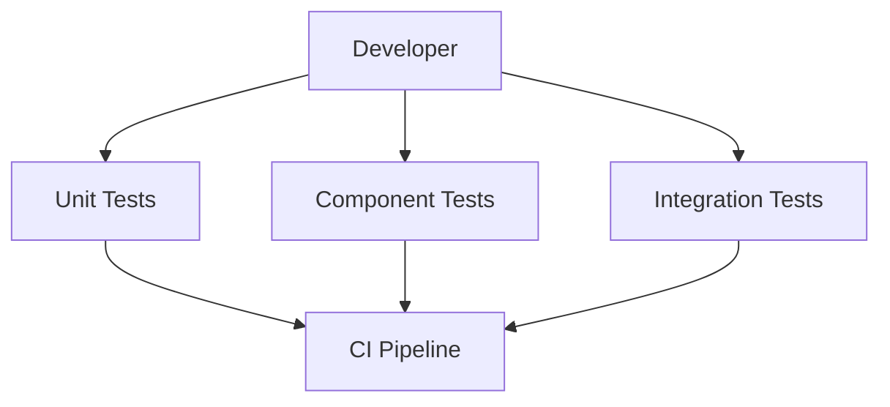
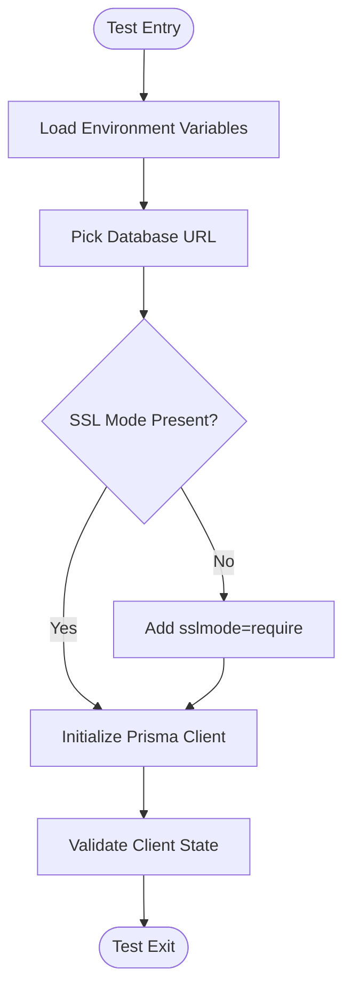
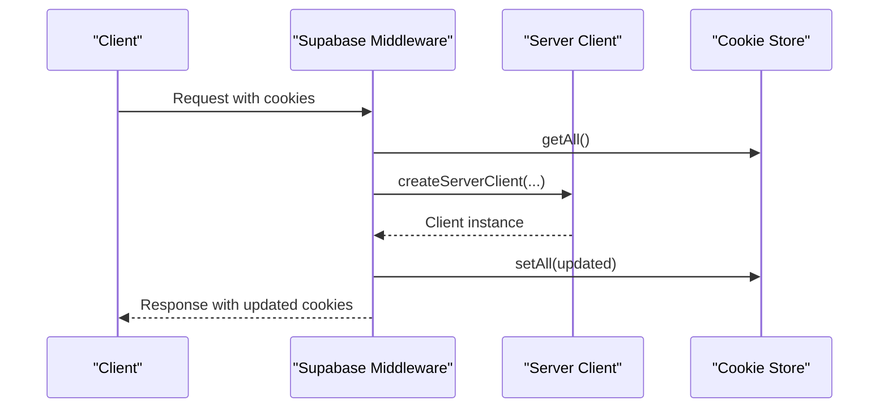
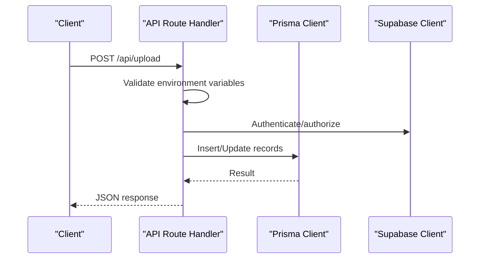
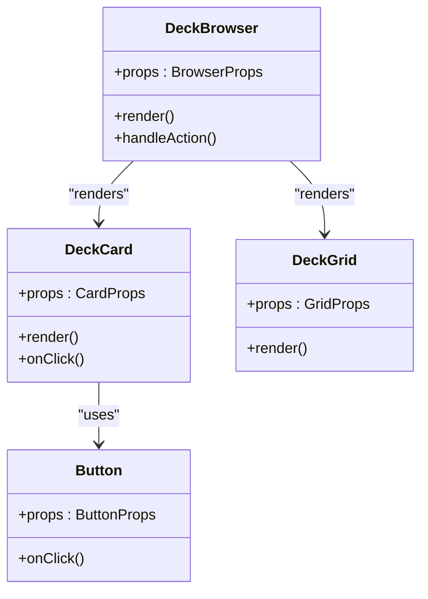
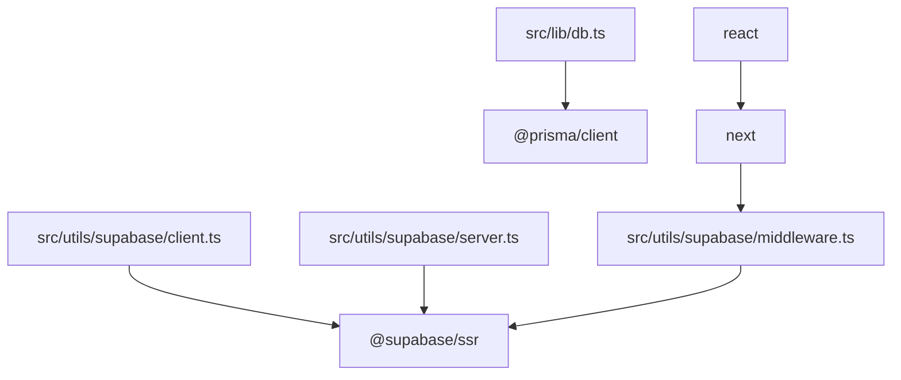

# Testing Strategy

<cite>
**Referenced Files in This Document**
- [package.json](file://package.json)
- [README.md](file://README.md)
- [src/lib/db.ts](file://src/lib/db.ts)
- [src/utils/supabase/client.ts](file://src/utils/supabase/client.ts)
- [src/utils/supabase/server.ts](file://src/utils/supabase/server.ts)
- [src/utils/supabase/middleware.ts](file://src/utils/supabase/middleware.ts)
- [src/app/api/upload/route.ts](file://src/app/api/upload/route.ts)
- [src/app/api/decks/route.ts](file://src/app/api/decks/route.ts)
- [src/app/api/decks/[id]/cards/route.ts](file://src/app/api/decks/[id]/cards/route.ts)
- [src/app/api/review/route.ts](file://src/app/api/review/route.ts)
- [src/app/api/stats/overview/route.ts](file://src/app/api/stats/overview/route.ts)
- [src/app/api/stats/due-count/route.ts](file://src/app/api/stats/due-count/route.ts)
- [src/app/api/cards[id]/route.ts](file://src/app/api/cards[id]/route.ts)
- [src/app/api/upload/route.ts](file://src/app/api/upload/route.ts)
- [src/components/deck/DeckBrowser.tsx](file://src/components/deck/DeckBrowser.tsx)
- [src/components/deck/DeckCard.tsx](file://src/components/deck/DeckCard.tsx)
- [src/components/deck/DeckGrid.tsx](file://src/components/deck/DeckGrid.tsx)
- [src/components/ui/button.tsx](file://src/components/ui/button.tsx)
- [src/hooks/useDebounce.ts](file://src/hooks/useDebounce.ts)
- [src/lib/spaced-repetition.ts](file://src/lib/spaced-repetition.ts)
- [src/lib/stats.ts](file://src/lib/stats.ts)
- [src/lib/constants.ts](file://src/lib/constants.ts)
- [src/lib/utils.ts](file://src/lib/utils.ts)
- [src/lib/ai.ts](file://src/lib/ai.ts)
- [src/lib/pdf.ts](file://src/lib/pdf.ts)
- [src/app/layout.tsx](file://src/app/layout.tsx)
- [src/app/error.tsx](file://src/app/error.tsx)
- [src/app/loading.tsx](file://src/app/loading.tsx)
- [src/app/decks/[id]/page.tsx](file://src/app/decks/[id]/page.tsx)
- [src/app/decks/page.tsx](file://src/app/decks/page.tsx)
- [src/app/stats/page.tsx](file://src/app/stats/page.tsx)
- [src/app/upload/page.tsx](file://src/app/upload/page.tsx)
- [src/app/page.tsx](file://src/app/page.tsx)
- [src/middleware.ts](file://src/middleware.ts)
- [prisma/schema.prisma](file://prisma/schema.prisma)
- [prisma/migrations/20260421034221_init/migration.sql](file://prisma/migrations/20260421034221_init/migration.sql)
- [prisma/seed.ts](file://prisma/seed.ts)
- [scripts/setup-db.ts](file://scripts/setup-db.ts)
- [PRODUCTION_FIX_SUMMARY.md](file://PRODUCTION_FIX_SUMMARY.md)
- [SUPABASE_INTEGRATION_COMPLETE.md](file://SUPABASE_INTEGRATION_COMPLETE.md)
</cite>

## Table of Contents
1. [Introduction](#introduction)
2. [Project Structure](#project-structure)
3. [Core Components](#core-components)
4. [Architecture Overview](#architecture-overview)
5. [Detailed Component Analysis](#detailed-component-analysis)
6. [Dependency Analysis](#dependency-analysis)
7. [Performance Considerations](#performance-considerations)
8. [Troubleshooting Guide](#troubleshooting-guide)
9. [Conclusion](#conclusion)
10. [Appendices](#appendices)

## Introduction
This document outlines a comprehensive testing strategy for the recall application. It covers unit testing patterns for React components, utility functions, and database operations; integration testing for API endpoints, authentication flows, and data operations; component testing strategies, mock implementations, and test environment setup; testing libraries and assertion patterns; continuous integration considerations; and guidance for testing challenges specific to Next.js applications, server components, and database interactions. The goal is to help maintain high-quality, reliable code with strong test coverage.

## Project Structure
The project follows a Next.js 14 App Router structure with a clear separation of concerns:
- Application routes under src/app/api define server-side API endpoints.
- UI components live under src/components and are organized by feature.
- Utilities and libraries under src/lib encapsulate business logic and integrations.
- Supabase client utilities under src/utils/supabase handle SSR and middleware flows.
- Database access is centralized via Prisma through src/lib/db.ts.
- Prisma schema and migrations define the database model and evolve it over time.

```mermaid
graph TB
subgraph "Application Routes"
APIUpload["src/app/api/upload/route.ts"]
APIDecks["src/app/api/decks/route.ts"]
APICards["src/app/api/decks/[id]/cards/route.ts"]
APIReview["src/app/api/review/route.ts"]
APIStatsOverview["src/app/api/stats/overview/route.ts"]
APIStatsDue["src/app/api/stats/due-count/route.ts"]
APICard["src/app/api/cards[id]/route.ts"]
end
subgraph "Components"
CompDeckBrowser["src/components/deck/DeckBrowser.tsx"]
CompDeckCard["src/components/deck/DeckCard.tsx"]
CompDeckGrid["src/components/deck/DeckGrid.tsx"]
CompButton["src/components/ui/button.tsx"]
end
subgraph "Libraries"
LibDB["src/lib/db.ts"]
LibSpacedRep["src/lib/spaced-repetition.ts"]
LibStats["src/lib/stats.ts"]
LibUtils["src/lib/utils.ts"]
LibConstants["src/lib/constants.ts"]
LibAI["src/lib/ai.ts"]
LibPDF["src/lib/pdf.ts"]
end
subgraph "Supabase Utilities"
SupaClient["src/utils/supabase/client.ts"]
SupaServer["src/utils/supabase/server.ts"]
SupaMiddleware["src/utils/supabase/middleware.ts"]
end
APIUpload --> LibDB
APIDecks --> LibDB
APICards --> LibDB
APIReview --> LibDB
APIStatsOverview --> LibDB
APIStatsDue --> LibDB
APICard --> LibDB
CompDeckBrowser --> LibDB
CompDeckCard --> LibDB
CompDeckGrid --> LibDB
CompButton --> LibSpacedRep
LibDB --> SupaClient
LibDB --> SupaServer
SupaServer --> SupaMiddleware
```

**Diagram sources**
- [src/app/api/upload/route.ts:1-120](file://src/app/api/upload/route.ts#L1-L120)
- [src/app/api/decks/route.ts:1-120](file://src/app/api/decks/route.ts#L1-L120)
- [src/app/api/decks/[id]/cards/route.ts](file://src/app/api/decks/[id]/cards/route.ts#L1-L120)
- [src/app/api/review/route.ts:1-120](file://src/app/api/review/route.ts#L1-L120)
- [src/app/api/stats/overview/route.ts:1-120](file://src/app/api/stats/overview/route.ts#L1-L120)
- [src/app/api/stats/due-count/route.ts:1-120](file://src/app/api/stats/due-count/route.ts#L1-L120)
- [src/app/api/cards[id]/route.ts](file://src/app/api/cards[id]/route.ts#L1-L120)
- [src/components/deck/DeckBrowser.tsx:1-200](file://src/components/deck/DeckBrowser.tsx#L1-L200)
- [src/components/deck/DeckCard.tsx:1-200](file://src/components/deck/DeckCard.tsx#L1-L200)
- [src/components/deck/DeckGrid.tsx:1-200](file://src/components/deck/DeckGrid.tsx#L1-L200)
- [src/components/ui/button.tsx:1-200](file://src/components/ui/button.tsx#L1-L200)
- [src/lib/db.ts:1-68](file://src/lib/db.ts#L1-L68)
- [src/lib/spaced-repetition.ts:1-200](file://src/lib/spaced-repetition.ts#L1-L200)
- [src/lib/stats.ts:1-200](file://src/lib/stats.ts#L1-L200)
- [src/lib/utils.ts:1-200](file://src/lib/utils.ts#L1-L200)
- [src/lib/constants.ts:1-200](file://src/lib/constants.ts#L1-L200)
- [src/lib/ai.ts:1-200](file://src/lib/ai.ts#L1-L200)
- [src/lib/pdf.ts:1-200](file://src/lib/pdf.ts#L1-L200)
- [src/utils/supabase/client.ts:1-11](file://src/utils/supabase/client.ts#L1-L11)
- [src/utils/supabase/server.ts:1-29](file://src/utils/supabase/server.ts#L1-L29)
- [src/utils/supabase/middleware.ts:1-38](file://src/utils/supabase/middleware.ts#L1-L38)

**Section sources**
- [README.md:1-102](file://README.md#L1-L102)
- [package.json:1-56](file://package.json#L1-L56)

## Core Components
This section identifies the core building blocks that require testing attention:
- Database abstraction and connection management via src/lib/db.ts, which centralizes Prisma client initialization and environment-aware URL selection.
- Supabase utilities for client, server, and middleware flows under src/utils/supabase/*, which are essential for authentication and session management.
- API routes under src/app/api/*, which expose CRUD and domain-specific operations and require robust integration tests.
- UI components under src/components/*, which require unit tests for rendering, interactivity, and prop-driven behavior.
- Utility libraries under src/lib/*, which encapsulate business logic and should be tested independently for correctness and performance.

Key testing areas:
- Unit tests for utility functions and hooks to validate pure logic and side effects.
- Component tests for React components to assert rendering, accessibility, and event handling.
- Integration tests for API endpoints to validate request/response behavior, authentication, and database interactions.
- Environment and configuration tests to ensure proper setup of database and Supabase credentials.

**Section sources**
- [src/lib/db.ts:1-68](file://src/lib/db.ts#L1-L68)
- [src/utils/supabase/client.ts:1-11](file://src/utils/supabase/client.ts#L1-L11)
- [src/utils/supabase/server.ts:1-29](file://src/utils/supabase/server.ts#L1-L29)
- [src/utils/supabase/middleware.ts:1-38](file://src/utils/supabase/middleware.ts#L1-L38)
- [src/app/api/upload/route.ts:1-120](file://src/app/api/upload/route.ts#L1-L120)
- [src/app/api/decks/route.ts:1-120](file://src/app/api/decks/route.ts#L1-L120)
- [src/app/api/decks/[id]/cards/route.ts](file://src/app/api/decks/[id]/cards/route.ts#L1-L120)
- [src/app/api/review/route.ts:1-120](file://src/app/api/review/route.ts#L1-L120)
- [src/app/api/stats/overview/route.ts:1-120](file://src/app/api/stats/overview/route.ts#L1-L120)
- [src/app/api/stats/due-count/route.ts:1-120](file://src/app/api/stats/due-count/route.ts#L1-L120)
- [src/app/api/cards[id]/route.ts](file://src/app/api/cards[id]/route.ts#L1-L120)
- [src/components/deck/DeckBrowser.tsx:1-200](file://src/components/deck/DeckBrowser.tsx#L1-L200)
- [src/components/deck/DeckCard.tsx:1-200](file://src/components/deck/DeckCard.tsx#L1-L200)
- [src/components/deck/DeckGrid.tsx:1-200](file://src/components/deck/DeckGrid.tsx#L1-L200)
- [src/components/ui/button.tsx:1-200](file://src/components/ui/button.tsx#L1-L200)
- [src/lib/spaced-repetition.ts:1-200](file://src/lib/spaced-repetition.ts#L1-L200)
- [src/lib/stats.ts:1-200](file://src/lib/stats.ts#L1-L200)
- [src/lib/utils.ts:1-200](file://src/lib/utils.ts#L1-L200)
- [src/lib/constants.ts:1-200](file://src/lib/constants.ts#L1-L200)
- [src/lib/ai.ts:1-200](file://src/lib/ai.ts#L1-L200)
- [src/lib/pdf.ts:1-200](file://src/lib/pdf.ts#L1-L200)

## Architecture Overview
The testing architecture aligns with the application’s layered design:
- Unit tests validate isolated logic in utilities, hooks, and small components.
- Component tests validate UI behavior using lightweight test runners and mocking strategies.
- Integration tests validate API endpoints, database interactions, and Supabase flows end-to-end.
- CI pipelines enforce linting, type checks, and selected test suites to prevent regressions.

[No sources needed since this diagram shows conceptual workflow, not actual code structure]

## Detailed Component Analysis

### Database Layer Testing Strategy
The database layer is encapsulated in src/lib/db.ts, which:
- Selects the appropriate database URL based on environment and platform variables.
- Ensures SSL mode requirements for serverless environments.
- Initializes a singleton Prisma client for development and hot reload scenarios.

Recommended testing patterns:
- Mock Prisma client in unit tests to isolate logic from database connectivity.
- Use a test database instance for integration tests and clean up between runs.
- Validate URL selection logic with environment variable permutations.
- Assert Prisma client initialization and connection pooling behavior.

**Diagram sources**
- [src/lib/db.ts:8-67](file://src/lib/db.ts#L8-L67)

**Section sources**
- [src/lib/db.ts:1-68](file://src/lib/db.ts#L1-L68)
- [prisma/schema.prisma:1-200](file://prisma/schema.prisma#L1-L200)
- [prisma/migrations/20260421034221_init/migration.sql:1-200](file://prisma/migrations/20260421034221_init/migration.sql#L1-L200)
- [prisma/seed.ts:1-200](file://prisma/seed.ts#L1-L200)

### Supabase Authentication and Session Management Testing Strategy
Supabase utilities under src/utils/supabase/* provide:
- Client-side creation for browser contexts.
- Server-side creation with cookie store integration for SSR and server components.
- Middleware integration to refresh sessions and manage cookies across requests.

Recommended testing patterns:
- Mock environment variables for Supabase URLs and keys.
- Test server client creation with mocked cookie stores.
- Validate middleware behavior for cookie reads/writes and response updates.
- Simulate authentication flows and session refresh scenarios.

**Diagram sources**
- [src/utils/supabase/middleware.ts:1-38](file://src/utils/supabase/middleware.ts#L1-L38)
- [src/utils/supabase/server.ts:1-29](file://src/utils/supabase/server.ts#L1-L29)
- [src/utils/supabase/client.ts:1-11](file://src/utils/supabase/client.ts#L1-L11)

**Section sources**
- [src/utils/supabase/client.ts:1-11](file://src/utils/supabase/client.ts#L1-L11)
- [src/utils/supabase/server.ts:1-29](file://src/utils/supabase/server.ts#L1-L29)
- [src/utils/supabase/middleware.ts:1-38](file://src/utils/supabase/middleware.ts#L1-L38)

### API Endpoints Testing Strategy
API endpoints under src/app/api/* expose CRUD and domain operations. Recommended testing patterns:
- Unit tests for route handlers to validate request parsing, environment checks, and error responses.
- Integration tests to validate database writes/read operations, Supabase auth integration, and rate limiting.
- Snapshot tests for stable response shapes and status codes.
- Mock external services (e.g., AI generation) to avoid flakiness.

**Diagram sources**
- [src/app/api/upload/route.ts:86-106](file://src/app/api/upload/route.ts#L86-L106)
- [src/lib/db.ts:51-67](file://src/lib/db.ts#L51-L67)
- [src/utils/supabase/server.ts:7-28](file://src/utils/supabase/server.ts#L7-L28)

**Section sources**
- [src/app/api/upload/route.ts:1-120](file://src/app/api/upload/route.ts#L1-L120)
- [src/app/api/decks/route.ts:1-120](file://src/app/api/decks/route.ts#L1-L120)
- [src/app/api/decks/[id]/cards/route.ts](file://src/app/api/decks/[id]/cards/route.ts#L1-L120)
- [src/app/api/review/route.ts:1-120](file://src/app/api/review/route.ts#L1-L120)
- [src/app/api/stats/overview/route.ts:1-120](file://src/app/api/stats/overview/route.ts#L1-L120)
- [src/app/api/stats/due-count/route.ts:1-120](file://src/app/api/stats/due-count/route.ts#L1-L120)
- [src/app/api/cards[id]/route.ts](file://src/app/api/cards[id]/route.ts#L1-L120)

### UI Components Testing Strategy
React components under src/components/* should be tested for:
- Rendering correctness with various props and children.
- Event handling (e.g., button clicks, form submissions).
- Accessibility attributes and keyboard navigation.
- Interaction with hooks and context providers.

Recommended testing patterns:
- Use a lightweight test runner and DOM assertions.
- Mock external dependencies (e.g., Supabase clients, database calls).
- Test component composition and reusability.
- Validate loading states and error boundaries.

**Diagram sources**
- [src/components/deck/DeckBrowser.tsx:1-200](file://src/components/deck/DeckBrowser.tsx#L1-L200)
- [src/components/deck/DeckCard.tsx:1-200](file://src/components/deck/DeckCard.tsx#L1-L200)
- [src/components/deck/DeckGrid.tsx:1-200](file://src/components/deck/DeckGrid.tsx#L1-L200)
- [src/components/ui/button.tsx:1-200](file://src/components/ui/button.tsx#L1-L200)

**Section sources**
- [src/components/deck/DeckBrowser.tsx:1-200](file://src/components/deck/DeckBrowser.tsx#L1-L200)
- [src/components/deck/DeckCard.tsx:1-200](file://src/components/deck/DeckCard.tsx#L1-L200)
- [src/components/deck/DeckGrid.tsx:1-200](file://src/components/deck/DeckGrid.tsx#L1-L200)
- [src/components/ui/button.tsx:1-200](file://src/components/ui/button.tsx#L1-L200)

### Hooks and Utility Functions Testing Strategy
Hooks and utilities under src/hooks/* and src/lib/* should be tested for:
- Correctness of pure functions and transformations.
- Side effects and asynchronous behavior.
- Edge cases and invalid inputs.
- Performance characteristics for frequently called hooks.

Recommended testing patterns:
- Pure function tests for deterministic outputs.
- Async function tests with timeouts and cancellation.
- Hook tests using a testing library that supports React hooks lifecycle.

**Section sources**
- [src/hooks/useDebounce.ts:1-200](file://src/hooks/useDebounce.ts#L1-L200)
- [src/lib/spaced-repetition.ts:1-200](file://src/lib/spaced-repetition.ts#L1-L200)
- [src/lib/stats.ts:1-200](file://src/lib/stats.ts#L1-L200)
- [src/lib/utils.ts:1-200](file://src/lib/utils.ts#L1-L200)
- [src/lib/constants.ts:1-200](file://src/lib/constants.ts#L1-L200)
- [src/lib/ai.ts:1-200](file://src/lib/ai.ts#L1-L200)
- [src/lib/pdf.ts:1-200](file://src/lib/pdf.ts#L1-L200)

## Dependency Analysis
The testing strategy depends on several key dependencies and configurations:
- Prisma client for database operations and migrations.
- Supabase client utilities for authentication and session management.
- Next.js runtime for server components and middleware.
- Environment variables for database and Supabase configuration.

**Diagram sources**
- [package.json:18-41](file://package.json#L18-L41)
- [src/lib/db.ts:1-1](file://src/lib/db.ts#L1-L1)
- [src/utils/supabase/client.ts:1-1](file://src/utils/supabase/client.ts#L1-L1)
- [src/utils/supabase/server.ts:1-1](file://src/utils/supabase/server.ts#L1-L1)
- [src/utils/supabase/middleware.ts:1-1](file://src/utils/supabase/middleware.ts#L1-L1)

**Section sources**
- [package.json:1-56](file://package.json#L1-L56)
- [src/lib/db.ts:1-68](file://src/lib/db.ts#L1-L68)
- [src/utils/supabase/client.ts:1-11](file://src/utils/supabase/client.ts#L1-L11)
- [src/utils/supabase/server.ts:1-29](file://src/utils/supabase/server.ts#L1-L29)
- [src/utils/supabase/middleware.ts:1-38](file://src/utils/supabase/middleware.ts#L1-L38)

## Performance Considerations
- Keep unit tests fast by mocking external dependencies and avoiding real network calls.
- Use lightweight test runners and avoid heavy frameworks for simple assertions.
- For integration tests, reuse a single database instance and clean up efficiently between tests.
- Minimize reliance on real AI services; mock them to reduce flakiness and cost.
- Consider snapshot tests for stable UI structures to detect unintended layout changes.

[No sources needed since this section provides general guidance]

## Troubleshooting Guide
Common testing pitfalls and resolutions:
- Database connectivity failures in CI: Ensure DATABASE_URL is set in CI environment and that migrations are applied before running tests.
- Supabase authentication failures: Verify NEXT_PUBLIC_SUPABASE_URL and NEXT_PUBLIC_SUPABASE_PUBLISHABLE_KEY are present in test environments.
- Serverless SSL requirements: Confirm sslmode=require is appended to database URLs in serverless environments.
- Middleware and server component issues: Mock cookie stores and request/response objects to simulate server-side behavior.
- Rate limiting and environment checks: Validate that environment preflight checks pass and rate limit logic behaves as expected.

**Section sources**
- [src/lib/db.ts:41-47](file://src/lib/db.ts#L41-L47)
- [src/app/api/upload/route.ts:86-106](file://src/app/api/upload/route.ts#L86-L106)
- [src/utils/supabase/middleware.ts:1-38](file://src/utils/supabase/middleware.ts#L1-L38)
- [PRODUCTION_FIX_SUMMARY.md:1-83](file://PRODUCTION_FIX_SUMMARY.md#L1-L83)
- [SUPABASE_INTEGRATION_COMPLETE.md:1-132](file://SUPABASE_INTEGRATION_COMPLETE.md#L1-L132)

## Conclusion
A robust testing strategy for recall combines unit, component, and integration tests with careful attention to environment setup, mocking, and CI considerations. By focusing on the database abstraction, Supabase utilities, API endpoints, and UI components, teams can achieve high confidence in functionality, reliability, and maintainability. Adopting the recommended patterns and addressing the identified challenges will support scalable development and continuous delivery.

[No sources needed since this section summarizes without analyzing specific files]

## Appendices

### Continuous Integration Considerations
- Linting and type checking should run in CI to catch issues early.
- Separate test jobs for unit, component, and integration tests to optimize feedback loops.
- Use ephemeral databases for integration tests and clean up after each run.
- Cache dependencies to speed up CI builds.

**Section sources**
- [package.json:5-16](file://package.json#L5-L16)

### Testing Libraries and Assertion Patterns
- Choose a lightweight test runner suitable for React and Node.js environments.
- Use mocking libraries to isolate external dependencies (Supabase, Prisma, AI services).
- Prefer snapshot tests for UI stability and regression detection.
- Use environment variable mocks to simulate production-like conditions.

[No sources needed since this section provides general guidance]

### Guidelines for Writing Effective Tests
- Write focused tests that validate a single behavior or concern.
- Use descriptive names and comments to explain intent.
- Keep tests independent and order-independent.
- Maintain a balance between coverage and maintainability.

[No sources needed since this section provides general guidance]