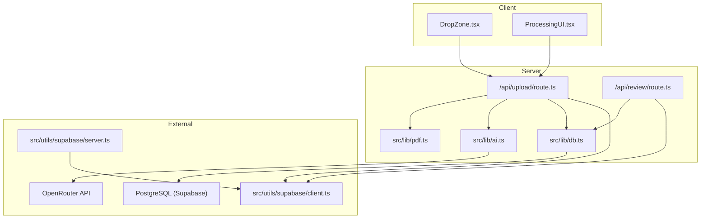
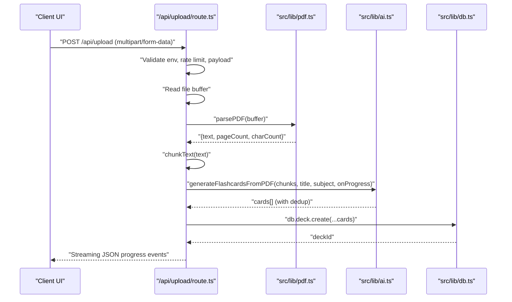
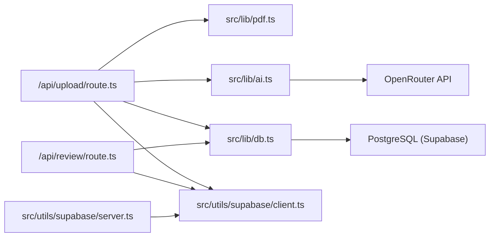

# Troubleshooting & FAQ

<cite>
**Referenced Files in This Document**
- [README.md](file://README.md)
- [SUPABASE_SETUP.md](file://SUPABASE_SETUP.md)
- [SUPABASE_SETUP_COMPLETE.md](file://SUPABASE_SETUP_COMPLETE.md)
- [PRODUCTION_FIX_SUMMARY.md](file://PRODUCTION_FIX_SUMMARY.md)
- [package.json](file://package.json)
- [src/lib/db.ts](file://src/lib/db.ts)
- [src/utils/supabase/client.ts](file://src/utils/supabase/client.ts)
- [src/utils/supabase/server.ts](file://src/utils/supabase/server.ts)
- [src/app/api/upload/route.ts](file://src/app/api/upload/route.ts)
- [src/app/api/review/route.ts](file://src/app/api/review/route.ts)
- [src/lib/pdf.ts](file://src/lib/pdf.ts)
- [src/lib/ai.ts](file://src/lib/ai.ts)
- [src/app/error.tsx](file://src/app/error.tsx)
- [src/components/upload/DropZone.tsx](file://src/components/upload/DropZone.tsx)
- [src/components/upload/ProcessingUI.tsx](file://src/components/upload/ProcessingUI.tsx)
</cite>

## Table of Contents
1. [Introduction](#introduction)
2. [Project Structure](#project-structure)
3. [Core Components](#core-components)
4. [Architecture Overview](#architecture-overview)
5. [Detailed Component Analysis](#detailed-component-analysis)
6. [Dependency Analysis](#dependency-analysis)
7. [Performance Considerations](#performance-considerations)
8. [Troubleshooting Guide](#troubleshooting-guide)
9. [FAQ](#faq)
10. [Conclusion](#conclusion)

## Introduction
This document provides comprehensive troubleshooting guidance and FAQs for the recall application. It focuses on setup issues, database connectivity, environment configuration, PDF processing failures, AI API integration, authentication problems, debugging techniques, log analysis, error resolution strategies, performance tuning, and production deployment pitfalls. The goal is to help developers and operators quickly diagnose and resolve issues across local development, CI/CD, and production environments.

## Project Structure
The application is a Next.js 14 App Router application with:
- A PDF upload pipeline that parses PDFs, chunks content, generates flashcards via AI, and persists decks/cards to a PostgreSQL database.
- Supabase integration for SSR-compatible client utilities and middleware-driven session management.
- Streaming progress responses for long-running operations.
- Strict environment variable requirements for database and AI APIs.

**Diagram sources**
- [src/components/upload/DropZone.tsx:1-100](file://src/components/upload/DropZone.tsx#L1-L100)
- [src/components/upload/ProcessingUI.tsx:1-53](file://src/components/upload/ProcessingUI.tsx#L1-L53)
- [src/app/api/upload/route.ts:1-298](file://src/app/api/upload/route.ts#L1-L298)
- [src/app/api/review/route.ts:1-76](file://src/app/api/review/route.ts#L1-L76)
- [src/lib/db.ts:1-68](file://src/lib/db.ts#L1-L68)
- [src/lib/pdf.ts:1-112](file://src/lib/pdf.ts#L1-L112)
- [src/lib/ai.ts:1-233](file://src/lib/ai.ts#L1-L233)
- [src/utils/supabase/client.ts:1-11](file://src/utils/supabase/client.ts#L1-L11)
- [src/utils/supabase/server.ts:1-29](file://src/utils/supabase/server.ts#L1-L29)

**Section sources**
- [README.md:1-102](file://README.md#L1-L102)
- [package.json:1-56](file://package.json#L1-L56)

## Core Components
- Database client and URL selection logic with SSL enforcement and platform-aware datasource precedence.
- Supabase SSR utilities for server and browser clients with cookie management and middleware.
- PDF parsing and chunking pipeline optimized for serverless environments.
- AI generation pipeline with fallback models, retry logic, and deduplication.
- Upload API with streaming progress, rate limiting, and public error messaging.
- Review API implementing SM-2 spaced repetition updates with transactional persistence.
- Global error boundary UI for graceful error presentation.

**Section sources**
- [src/lib/db.ts:1-68](file://src/lib/db.ts#L1-L68)
- [src/utils/supabase/client.ts:1-11](file://src/utils/supabase/client.ts#L1-L11)
- [src/utils/supabase/server.ts:1-29](file://src/utils/supabase/server.ts#L1-L29)
- [src/lib/pdf.ts:1-112](file://src/lib/pdf.ts#L1-L112)
- [src/lib/ai.ts:1-233](file://src/lib/ai.ts#L1-L233)
- [src/app/api/upload/route.ts:1-298](file://src/app/api/upload/route.ts#L1-L298)
- [src/app/api/review/route.ts:1-76](file://src/app/api/review/route.ts#L1-L76)
- [src/app/error.tsx:1-44](file://src/app/error.tsx#L1-L44)

## Architecture Overview
The upload flow integrates PDF parsing, AI generation, deduplication, and database persistence. It streams progress to the client and handles errors gracefully. Authentication relies on Supabase with SSR utilities and middleware.

**Diagram sources**
- [src/app/api/upload/route.ts:86-298](file://src/app/api/upload/route.ts#L86-L298)
- [src/lib/pdf.ts:13-61](file://src/lib/pdf.ts#L13-L61)
- [src/lib/ai.ts:168-232](file://src/lib/ai.ts#L168-L232)
- [src/lib/db.ts:51-67](file://src/lib/db.ts#L51-L67)

## Detailed Component Analysis

### Database Connectivity and Environment Configuration
- URL selection logic prefers platform-specific variables in production and falls back to standard ones in development.
- SSL mode is enforced for serverless environments.
- The app requires a PostgreSQL connection; SQLite is not supported on Vercel due to ephemeral filesystems.

Common symptoms and resolutions:
- “Something went wrong” on pages that access the database.
- “Server Components render error” indicating database connection failure.
- Missing logs in production due to early crashes.

Resolution steps:
- Ensure DATABASE_URL points to PostgreSQL and includes sslmode=require.
- Run migrations to create required tables.
- Verify Supabase project is healthy and reachable.

**Section sources**
- [src/lib/db.ts:8-67](file://src/lib/db.ts#L8-L67)
- [SUPABASE_SETUP.md:72-93](file://SUPABASE_SETUP.md#L72-L93)
- [SUPABASE_SETUP_COMPLETE.md:125-142](file://SUPABASE_SETUP_COMPLETE.md#L125-L142)
- [PRODUCTION_FIX_SUMMARY.md:3-66](file://PRODUCTION_FIX_SUMMARY.md#L3-L66)

### Supabase Authentication and SSR Utilities
- Server-side client manages cookies and handles SSR cookie writes safely.
- Browser-side client reads public environment variables.
- Middleware supports session refresh and cookie propagation.

Common symptoms:
- Auth not persisting across sessions.
- Cookies not set in SSR contexts.

Resolution steps:
- Clear browser cookies and reload.
- Ensure NEXT_PUBLIC_SUPABASE_URL and NEXT_PUBLIC_SUPABASE_PUBLISHABLE_KEY are set.
- Confirm middleware is enabled and cookies are readable in server components.

**Section sources**
- [src/utils/supabase/server.ts:1-29](file://src/utils/supabase/server.ts#L1-L29)
- [src/utils/supabase/client.ts:1-11](file://src/utils/supabase/client.ts#L1-L11)
- [SUPABASE_SETUP_COMPLETE.md:125-142](file://SUPABASE_SETUP_COMPLETE.md#L125-L142)

### PDF Processing Pipeline
- Provides a DOMMatrix polyfill for serverless environments.
- Parses PDFs, removes page numbers and extra whitespace, collapses excessive newlines, trims lines, and returns metadata.
- Chunks text with overlap to preserve context for AI processing.

Common symptoms:
- “This PDF doesn't contain enough readable text”.
- Large PDFs timing out or exceeding limits.

Resolution steps:
- Ensure the PDF is text-based, not scanned/image-only.
- Reduce file size or split the PDF.
- Monitor chunk sizes and adjust maxChunkSize if needed.

**Section sources**
- [src/lib/pdf.ts:13-61](file://src/lib/pdf.ts#L13-L61)
- [src/lib/pdf.ts:67-112](file://src/lib/pdf.ts#L67-L112)
- [src/app/api/upload/route.ts:179-189](file://src/app/api/upload/route.ts#L179-L189)

### AI API Integration (OpenRouter)
- Lazily initializes OpenAI client with base URL pointing to OpenRouter.
- Uses fallback models when the primary model fails.
- Implements retry logic and JSON extraction with fallbacks.
- Adds a small delay between requests to respect free-tier rate limits.

Common symptoms:
- Missing OPENROUTER_API_KEY.
- Rate limit errors.
- Model not found or service overload.
- JSON parse failures.

Resolution steps:
- Set OPENROUTER_API_KEY in the environment.
- Wait before retrying after rate limit errors.
- Verify model availability and try again later.
- Inspect raw AI responses for fenced JSON blocks and adjust parsing.

**Section sources**
- [src/lib/ai.ts:8-24](file://src/lib/ai.ts#L8-L24)
- [src/lib/ai.ts:92-153](file://src/lib/ai.ts#L92-L153)
- [src/lib/ai.ts:166-232](file://src/lib/ai.ts#L166-L232)
- [src/app/api/upload/route.ts:14-63](file://src/app/api/upload/route.ts#L14-L63)

### Upload API: Streaming, Rate Limiting, and Error Messaging
- Enforces environment preflight checks for DATABASE_URL and OPENROUTER_API_KEY.
- Implements a simple per-IP rate limiter.
- Streams progress events with structured JSON lines.
- Translates internal errors into user-friendly messages.

Common symptoms:
- “Invalid form data” or “No file provided”.
- “Only PDF files are supported”.
- “File too large”.
- “Too many upload requests”.

Resolution steps:
- Validate file type and size before upload.
- Respect rate limits and retry after cooling off.
- Ensure environment variables are present in deployment.

**Section sources**
- [src/app/api/upload/route.ts:86-157](file://src/app/api/upload/route.ts#L86-L157)
- [src/app/api/upload/route.ts:164-298](file://src/app/api/upload/route.ts#L164-L298)

### Review API: Spaced Repetition Updates
- Validates input and loads the card.
- Applies SM-2 logic and persists updates atomically with a transaction.
- Logs reviews and updates deck timestamps.

Common symptoms:
- “Missing fields” or “Quality must be 0-5”.
- “Card not found”.

Resolution steps:
- Ensure cardId, deckId, and quality are provided and within range.
- Verify card exists before submitting review.

**Section sources**
- [src/app/api/review/route.ts:5-76](file://src/app/api/review/route.ts#L5-L76)

### UI Components: DropZone and ProcessingUI
- DropZone validates PDF type and size, exposes selected file.
- ProcessingUI cycles through status messages and animates progress.

Common symptoms:
- UI does not accept PDFs.
- Progress UI not visible.

Resolution steps:
- Confirm accept attribute and type checks.
- Ensure visibility prop is toggled correctly.

**Section sources**
- [src/components/upload/DropZone.tsx:21-44](file://src/components/upload/DropZone.tsx#L21-L44)
- [src/components/upload/ProcessingUI.tsx:12-31](file://src/components/upload/ProcessingUI.tsx#L12-L31)

## Dependency Analysis
The system depends on:
- Prisma client for database access with PostgreSQL provider.
- Supabase client libraries for SSR and browser usage.
- OpenRouter via OpenAI client wrapper.
- pdf-parse for PDF text extraction.

**Diagram sources**
- [src/app/api/upload/route.ts:1-10](file://src/app/api/upload/route.ts#L1-L10)
- [src/lib/pdf.ts:1-5](file://src/lib/pdf.ts#L1-L5)
- [src/lib/ai.ts](file://src/lib/ai.ts#L1)
- [src/lib/db.ts](file://src/lib/db.ts#L1)
- [src/utils/supabase/client.ts](file://src/utils/supabase/client.ts#L1)
- [src/utils/supabase/server.ts](file://src/utils/supabase/server.ts#L1)

**Section sources**
- [package.json:18-41](file://package.json#L18-L41)

## Performance Considerations
- Cold start impact: Lazy-loading pdf-parse reduces initial bundle size.
- Streaming: Upload API streams progress to keep UI responsive.
- Rate limiting: Built-in per-IP limiter prevents abuse and respects AI free tiers.
- Chunking: Overlapping chunks improve AI context while controlling token budgets.
- Transactional writes: Atomic updates reduce partial writes and improve reliability.

Recommendations:
- Monitor AI latency and adjust chunk sizes accordingly.
- Use smaller batches for very large PDFs.
- Keep environment variables cached and avoid repeated reinitialization.

[No sources needed since this section provides general guidance]

## Troubleshooting Guide

### Setup and Environment
- Symptom: “Server is missing DATABASE_URL.”
  - Action: Set DATABASE_URL in your deployment environment and redeploy.
- Symptom: “Server is missing OPENROUTER_API_KEY.”
  - Action: Add OPENROUTER_API_KEY to the server environment.
- Symptom: “Something went wrong” on pages accessing the database.
  - Action: Run migrations and verify database connectivity.

**Section sources**
- [src/app/api/upload/route.ts:87-106](file://src/app/api/upload/route.ts#L87-L106)
- [SUPABASE_SETUP.md:72-93](file://SUPABASE_SETUP.md#L72-L93)

### Database Connection Problems
- Symptom: “Connection refused” or “Relation does not exist.”
  - Action: Update DATABASE_URL with the correct password and run migrations.
- Symptom: “Authentication failed” or Prisma error codes.
  - Action: Verify credentials and network access; ensure sslmode=require is present.

**Section sources**
- [SUPABASE_SETUP_COMPLETE.md:125-142](file://SUPABASE_SETUP_COMPLETE.md#L125-L142)
- [src/lib/db.ts:41-47](file://src/lib/db.ts#L41-L47)

### PDF Processing Failures
- Symptom: “This PDF doesn't contain enough readable text.”
  - Action: Use a text-based PDF; avoid scanned/image-only documents.
- Symptom: Large PDFs timeout.
  - Action: Split the file or reduce size; monitor chunk counts.

**Section sources**
- [src/app/api/upload/route.ts:179-189](file://src/app/api/upload/route.ts#L179-L189)
- [src/lib/pdf.ts:34-54](file://src/lib/pdf.ts#L34-L54)

### AI API Integration Issues
- Symptom: Missing OPENROUTER_API_KEY.
  - Action: Set OPENROUTER_API_KEY and redeploy.
- Symptom: Rate limit errors.
  - Action: Wait and retry; consider upgrading or throttling requests.
- Symptom: Model not found or service overload.
  - Action: Retry later; fallback models are used automatically.

**Section sources**
- [src/lib/ai.ts:12-16](file://src/lib/ai.ts#L12-L16)
- [src/lib/ai.ts:92-153](file://src/lib/ai.ts#L92-L153)
- [src/app/api/upload/route.ts:14-48](file://src/app/api/upload/route.ts#L14-L48)

### Authentication Problems
- Symptom: Auth not persisting.
  - Action: Clear browser cookies and restart the dev server.
- Symptom: Cookies not set in SSR.
  - Action: Ensure middleware is configured and cookies are readable.

**Section sources**
- [SUPABASE_SETUP_COMPLETE.md:135-137](file://SUPABASE_SETUP_COMPLETE.md#L135-L137)
- [src/utils/supabase/server.ts:16-24](file://src/utils/supabase/server.ts#L16-L24)

### Debugging Techniques and Log Analysis
- Enable verbose logging around upload pipeline stages.
- Inspect streaming progress events for stage transitions.
- Capture and correlate client-side errors with server logs.
- Use the global error boundary to surface actionable messages.

**Section sources**
- [src/app/api/upload/route.ts:171-178](file://src/app/api/upload/route.ts#L171-L178)
- [src/app/api/upload/route.ts:204-209](file://src/app/api/upload/route.ts#L204-L209)
- [src/app/error.tsx:14-17](file://src/app/error.tsx#L14-L17)

### Error Handling Patterns and Graceful Degradation
- Public error messages are sanitized and user-friendly.
- Upload pipeline continues streaming errors to the client.
- Deduplication and fallbacks prevent total failure on partial data.

**Section sources**
- [src/app/api/upload/route.ts:11-63](file://src/app/api/upload/route.ts#L11-L63)
- [src/lib/ai.ts:211-216](file://src/lib/ai.ts#L211-L216)

### Production Deployment Issues and Runtime Errors
- Symptom: No logs in production.
  - Cause: Early crash before logging.
  - Fix: Ensure DATABASE_URL is set; logs will appear after successful connection.
- Symptom: “Create a new deck / Something went wrong.”
  - Cause: Database connectivity issues.
  - Fix: Set DATABASE_URL and run migrations.

**Section sources**
- [PRODUCTION_FIX_SUMMARY.md:64-66](file://PRODUCTION_FIX_SUMMARY.md#L64-L66)
- [PRODUCTION_FIX_SUMMARY.md:60-62](file://PRODUCTION_FIX_SUMMARY.md#L60-L62)

## FAQ

### Feature Limitations
- Only PDFs are supported for uploads.
- Free-tier AI rate limits apply; expect delays and retries.
- Scanned/image-based PDFs are not supported.

**Section sources**
- [src/app/api/upload/route.ts:139-144](file://src/app/api/upload/route.ts#L139-L144)
- [src/lib/ai.ts:92-153](file://src/lib/ai.ts#L92-L153)
- [src/app/api/upload/route.ts:179-189](file://src/app/api/upload/route.ts#L179-L189)

### Browser Compatibility
- The app targets modern browsers; ensure JavaScript and Fetch API are supported.
- Drag-and-drop and FileReader APIs are used for uploads.

**Section sources**
- [src/components/upload/DropZone.tsx:38-74](file://src/components/upload/DropZone.tsx#L38-L74)

### Usage Scenarios
- Upload a PDF to generate flashcards for spaced repetition.
- Submit review ratings to update card scheduling.
- Verify database connectivity and table presence using the Supabase SQL Editor.

**Section sources**
- [README.md:24-67](file://README.md#L24-L67)
- [SUPABASE_SETUP.md:83-88](file://SUPABASE_SETUP.md#L83-L88)

### Environment Variables
- DATABASE_URL: PostgreSQL connection string with sslmode=require.
- OPENROUTER_API_KEY: API key for OpenRouter.
- NEXT_PUBLIC_SUPABASE_URL and NEXT_PUBLIC_SUPABASE_PUBLISHABLE_KEY: Supabase public keys.

**Section sources**
- [README.md:43-47](file://README.md#L43-L47)
- [SUPABASE_SETUP.md:38-56](file://SUPABASE_SETUP.md#L38-L56)
- [SUPABASE_SETUP_COMPLETE.md:17-29](file://SUPABASE_SETUP_COMPLETE.md#L17-L29)

### Performance and Optimization
- Keep PDFs text-based and under 20 MB.
- Reduce chunk size for dense content.
- Avoid frequent retries to respect AI rate limits.

**Section sources**
- [src/app/api/upload/route.ts:145-151](file://src/app/api/upload/route.ts#L145-L151)
- [src/lib/pdf.ts:67-112](file://src/lib/pdf.ts#L67-L112)
- [src/lib/ai.ts:225-229](file://src/lib/ai.ts#L225-L229)

## Conclusion
By aligning environment variables, validating database connectivity, ensuring PDFs are text-based, and configuring AI and Supabase correctly, most issues can be resolved quickly. Use the provided diagnostics, streaming progress, and global error boundary to isolate problems. Follow the production fix summary and setup guides to stabilize deployments and maintain reliable performance.